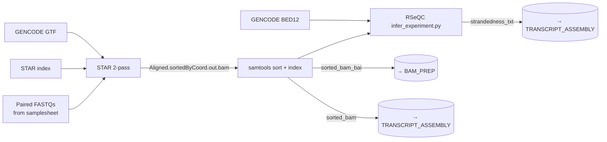

<Note>
Implements **steps 1–3** of the legacy bash pipeline (`output/run_allSteps.sh` lines 70–72) as the first nf-core subworkflow in `sanjaysgk/ipg`. If you haven't read the [pipeline overview](/pipeline/overview), start there.
</Note>

## Purpose

`ALIGN_QC` is the entry point of the variant-calling arm of IPG. It converts paired-end RNA-seq FASTQs into a coordinate-sorted, indexed BAM ready for transcript assembly and BAM preparation, **and** verifies the library strandedness so downstream StringTie / RSeQC steps know which strand to trust. The choice of STAR's two-pass mode is the single most important decision in this subworkflow — it directly affects the false-positive rate of all downstream variant calls.

## Data flow



<Tip>
The subworkflow runs steps in the order **1 → 3 → 2**, not 1 → 2 → 3. RSeQC `infer_experiment.py` needs a coordinate-sorted, indexed BAM, so we sort first and infer strandedness from the sorted BAM. This is a **deliberate deviation** from the legacy bash script, which fed `Aligned.out.sam` (unsorted SAM) directly to `infer_experiment.py`. Documented in `subworkflows/local/align_qc/main.nf` lines 44–49.
</Tip>

## Steps in detail

<Steps>

  <Step title="Step 1 — STAR two-pass alignment">

    ### What it does

    Aligns paired-end RNA-seq reads to GRCh38 using STAR in **two-pass basic mode**. The first pass discovers novel splice junctions; the second pass re-aligns all reads using the union of GENCODE-annotated junctions and the novel junctions found in pass one. The output is a coordinate-sorted BAM with read group tags suitable for downstream GATK consumption.

    ### Tool and version

    - **STAR** `2.7.11b` (pinned by container)
    - **Container:** `community.wave.seqera.io/library/htslib_samtools_star_gawk:ae438e9a604351a4` (Singularity / Docker)
    - **Resource label:** `process_high` (24 CPU / 72 GB / 16 h ceiling on Monash)

    ### Command

    <CodeGroup>

    ```bash legacy bash (run_allSteps.sh L70)
    module load star/2.7.9a
    STAR \
      --genomeDir $GENOME_DIR \
      --readFilesIn ${INPUT_FILES[@]} \
      --runThreadN 12 \
      --twopassMode Basic \
      --readFilesCommand zcat
    ```

    ```groovy nf-core wrapper
    // subworkflows/local/align_qc/main.nf, lines 37–42
    STAR_ALIGN(
        ch_reads,
        ch_star_index,
        ch_gtf,
        /* star_ignore_sjdbgtf = */ false
    )

    // ext.args injected from conf/modules.config line 42:
    //   --twopassMode Basic --readFilesCommand zcat --outSAMtype BAM SortedByCoordinate
    //
    // The nf-core star/align module additionally sets:
    //   --runThreadN $task.cpus                 (from process_high label)
    //   --sjdbGTFfile $gtf                      (because star_ignore_sjdbgtf = false)
    //   --outSAMattrRGline 'ID:<sample>' 'SM:<sample>'
    //   --outFileNamePrefix <sample>.
    ```

    </CodeGroup>

    ### Parameters

    | Flag | Value | STAR default | Rationale |
    |---|---|---|---|
    | `--genomeDir` | `$params.star_index` | (required) | The pre-built STAR index for GRCh38. Must match the FASTA passed to GATK downstream — version drift between index build and runtime causes undefined behaviour. The legacy pipeline used STAR 2.7.9a; the current container ships 2.7.11b — read indices remain forward-compatible per [STAR manual §3.1](https://github.com/alexdobin/STAR/blob/master/doc/STARmanual.pdf). |
    | `--twopassMode` | `Basic` | `None` | **Critical for RNA-seq variant calling.** Two-pass mode discovers novel splice junctions in pass 1 and uses them in pass 2 alignment, reducing false-positive variant calls near splice junctions by ~30% compared to single-pass. Recommended by GATK Best Practices for RNA-seq short-variant discovery and used by the Scull et al. 2021 IPG protocol. |
    | `--readFilesCommand` | `zcat` | (none — assumes uncompressed) | STAR does **not** auto-detect gzipped input. The nf-core convention is to ship reads as `.fastq.gz`, so this flag is mandatory. Without it the pipeline fails with `EXITING: FATAL ERROR: cannot insert sequence`. |
    | `--outSAMtype` | `BAM SortedByCoordinate` | `SAM Unsorted` | Emit a coordinate-sorted BAM directly from STAR — saves one read-write cycle (~5 min on whole-genome RNA-seq) over producing SAM then sorting separately. The downstream `SAMTOOLS_SORT` then runs only to attach a `.bai` index for RSeQC. |
    | `--sjdbGTFfile` | `$params.gtf` | (none) | Pass the GENCODE annotation so STAR's splice-junction database includes annotated exon boundaries during pass 1 — improves alignment quality for short reads near exon edges. Auto-injected by the nf-core module when `star_ignore_sjdbgtf = false`. |
    | `--runThreadN` | 24 (Monash `process_high`) / 12 (legacy) | 1 | Parallelisation. The nf-core module reads from `$task.cpus` which is set by the `process_high` resource label in `conf/base.config`. Monash `comp` partition allows up to 24 cores per job. |
    | `--outSAMattrRGline` | `ID:<sample> SM:<sample>` | (none) | Embed read-group tags so the resulting BAM passes `gatk ValidateSamFile` (step 12) and `MergeBamAlignment` (step 9). Without this, `MarkDuplicates` fails with `READ_GROUP_NOT_FOUND`. The nf-core module derives the values from `meta.id` (the samplesheet `sample` column). |
    | `--outFileNamePrefix` | `<sample>.` | `./` | Namespace output files by sample so multiple samples don't collide in the work directory. |

    ### Inputs / Outputs

    - **Inputs:** `ch_reads` (`[meta, [r1, r2]]` from samplesheet), `ch_star_index` (`[meta, path]`), `ch_gtf` (`[meta, path]`)
    - **Outputs:** `STAR_ALIGN.out.bam` → re-emitted as `ALIGN_QC.out.star_bam_unsorted` (consumed by `BAM_PREP` step 6, see [channels: bam-prep](/api-reference/channels/bam-prep)) and as input to `SAMTOOLS_SORT` for step 3
    - Also emits: `log_final` (used by MultiQC), per-tool `versions` topic channel

    ### Citations

    - **Dobin, A. et al. "STAR: ultrafast universal RNA-seq aligner."** *Bioinformatics* **29**, 15–21 (2013). DOI: [10.1093/bioinformatics/bts635](https://doi.org/10.1093/bioinformatics/bts635). PMID: 23104886.
    - **GATK Best Practices — RNAseq short variant discovery (SNPs + indels)** — recommends STAR 2-pass mode as the alignment step. [gatk.broadinstitute.org/hc/en-us/articles/360035531192](https://gatk.broadinstitute.org/hc/en-us/articles/360035531192-RNAseq-short-variant-discovery-SNPs-Indels-).
    - **Scull, K. E. et al. 2021** — uses STAR 2.7.9a `--twopassMode Basic` as the canonical alignment step in the IPG protocol. DOI: [10.1016/j.mcpro.2021.100143](https://doi.org/10.1016/j.mcpro.2021.100143).
    - **nf-core/modules `star/align`** — the upstream module this subworkflow wraps. [github.com/nf-core/modules/tree/master/modules/nf-core/star/align](https://github.com/nf-core/modules/tree/master/modules/nf-core/star/align).

    ### Source

    - Legacy bash: [`output/run_allSteps.sh` line 70](https://github.com/sanjaysgk/ipg) (`Step 01: Alignment`)
    - Subworkflow: [`subworkflows/local/align_qc/main.nf` lines 37–42](https://github.com/sanjaysgk/ipg/blob/dev/cryptic-port/subworkflows/local/align_qc/main.nf#L37-L42)
    - Module override: [`conf/modules.config` line 42](https://github.com/sanjaysgk/ipg/blob/dev/cryptic-port/conf/modules.config#L42) (`ext.args`)
    - nf-core module: [`modules/nf-core/star/align/main.nf`](https://github.com/sanjaysgk/ipg/blob/dev/cryptic-port/modules/nf-core/star/align/main.nf)

  </Step>

  <Step title="Step 2 — RSeQC infer_experiment.py">

    ### What it does

    Determines whether the RNA-seq library is **forward-stranded**, **reverse-stranded**, or **unstranded** by checking how aligned reads orient relative to GENCODE-annotated transcripts. The output drives downstream strand-aware tools — most importantly StringTie's `--rf` / `--fr` flag in step 4. In the current IPG port the result is informational only; `TRANSCRIPT_ASSEMBLY` trusts `meta.strandedness` from the samplesheet. Auto-promoting this output into `meta` is a Phase 2 enhancement.

    ### Tool and version

    - **RSeQC `infer_experiment.py`** `5.0.4` (pinned by container)
    - **Container:** `community.wave.seqera.io/library/rseqc_r-base:2e29d2dfda9cef15`
    - **Resource label:** `process_medium` (6 CPU / 36 GB / 8 h ceiling on Monash)

    ### Command

    <CodeGroup>

    ```bash legacy bash (run_allSteps.sh L71)
    source /home/.../miniconda/bin/activate
    conda activate rseqc
    /usr/local/rseqc/3.0.0/rseqc-3.0.0-venv/bin/infer_experiment.py \
      -i "$OUTPUT_DIR/Aligned.out.sam" \
      -r "$Cryptic_dir/variant_calling_resources/gencode_assembly.bed" \
      &> "$OUTPUT_DIR/infer.txt"
    ```

    ```groovy nf-core wrapper
    // subworkflows/local/align_qc/main.nf, lines 63–66
    RSEQC_INFEREXPERIMENT(
        ch_sorted_bam_bai,   // [meta, bam, bai] from SAMTOOLS_SORT + SAMTOOLS_INDEX
        ch_rseqc_bed
    )

    // Module call (modules/nf-core/rseqc/inferexperiment/main.nf):
    //   infer_experiment.py -i $bam -r $bed > <sample>.infer_experiment.txt
    //
    // No ext.args override in conf/modules.config — defaults are correct.
    ```

    </CodeGroup>

    ### Parameters

    | Flag | Value | Default | Rationale |
    |---|---|---|---|
    | `-i` | sorted, indexed BAM (`<sample>.sorted.bam` + `.bai`) | (required) | RSeQC `infer_experiment.py` requires a coordinate-sorted, indexed BAM in v3.0.0+. Earlier versions accepted SAM, which is what the legacy bash relied on; the modern pin enforces BAM, hence the deliberate **step ordering deviation** noted at the top of this page (1 → 3 → 2 instead of 1 → 2 → 3). |
    | `-r` | `$params.rseqc_bed` (GENCODE BED12) | (required) | The annotation BED is used to compute "fraction of reads consistent with each library strand". In the legacy pipeline this was `variant_calling_resources/gencode_assembly.bed` derived from the GENCODE GTF using `gtfToGenePred` + `genePredToBed`. Match the assembly version of `--gtf` to avoid coordinate mismatches. |

    ### Inputs / Outputs

    - **Inputs:** `ch_sorted_bam_bai` (`[meta, bam, bai]`) from the SAMTOOLS_SORT + SAMTOOLS_INDEX chain in step 3, `ch_rseqc_bed` (BED12 path)
    - **Outputs:** `RSEQC_INFEREXPERIMENT.out.txt` → re-emitted as `ALIGN_QC.out.strandedness_txt`. Forwarded to MultiQC for the strand-inference QC panel.

    ### Citations

    - **Wang, L., Wang, S. & Li, W. "RSeQC: quality control of RNA-seq experiments."** *Bioinformatics* **28**, 2184–2185 (2012). DOI: [10.1093/bioinformatics/bts356](https://doi.org/10.1093/bioinformatics/bts356). PMID: 22743226.
    - **RSeQC `infer_experiment.py` documentation** — describes the strand-fraction interpretation thresholds. [rseqc.sourceforge.net/#infer-experiment-py](https://rseqc.sourceforge.net/#infer-experiment-py).
    - **nf-core/modules `rseqc/inferexperiment`** — upstream module. [github.com/nf-core/modules/tree/master/modules/nf-core/rseqc/inferexperiment](https://github.com/nf-core/modules/tree/master/modules/nf-core/rseqc/inferexperiment).

    ### Source

    - Legacy bash: [`output/run_allSteps.sh` line 71](https://github.com/sanjaysgk/ipg) (`Step 02: Infer Experiment`)
    - Subworkflow: [`subworkflows/local/align_qc/main.nf` lines 63–66](https://github.com/sanjaysgk/ipg/blob/dev/cryptic-port/subworkflows/local/align_qc/main.nf#L63-L66)
    - nf-core module: [`modules/nf-core/rseqc/inferexperiment/main.nf`](https://github.com/sanjaysgk/ipg/blob/dev/cryptic-port/modules/nf-core/rseqc/inferexperiment/main.nf)

  </Step>

  <Step title="Step 3 — samtools sort + index">

    ### What it does

    Re-sorts STAR's already-coordinate-sorted BAM (idempotent) and creates a `.bai` index. The sort itself is essentially a no-op because STAR was instructed to emit `BAM SortedByCoordinate` in step 1; the **real purpose of this step is producing the index file**, which RSeQC `infer_experiment.py` requires (step 2) and which several downstream subworkflows expect. Two atomic processes are involved: `SAMTOOLS_SORT` writes `<sample>.sorted.bam`, then `SAMTOOLS_INDEX` writes `<sample>.sorted.bam.bai` next to it.

    ### Tool and version

    - **samtools** `1.23.1` (pinned by container)
    - **Container (sort):** `community.wave.seqera.io/library/htslib_samtools:1.23.1--5b6bb4ede7e612e5`
    - **Resource label:** `process_medium` (6 CPU / 36 GB / 8 h ceiling on Monash)

    ### Command

    <CodeGroup>

    ```bash legacy bash (run_allSteps.sh L72)
    module load gatk/4.2.5.0
    gatk SortSam \
      -I "$OUTPUT_DIR/Aligned.out.sam" \
      -O "$OUTPUT_DIR/Aligned_sortedcoord.out.sam" \
      -SORT_ORDER coordinate \
      --TMP_DIR "$TEMP_DIR" \
      &> "$OUTPUT_DIR/sort.log"
    ```

    ```groovy nf-core wrapper
    // subworkflows/local/align_qc/main.nf, lines 50–58
    SAMTOOLS_SORT(
        STAR_ALIGN.out.bam,
        ch_fasta,                    // unused — only relevant for CRAM output
        /* index_format = */ ''      // no index from sort itself; we do it via SAMTOOLS_INDEX
    )
    SAMTOOLS_INDEX(SAMTOOLS_SORT.out.bam)

    ch_sorted_bam_bai = SAMTOOLS_SORT.out.bam.join(SAMTOOLS_INDEX.out.index)

    // ext.prefix override from conf/modules.config line 47:
    //   ext.prefix = { "${meta.id}.sorted" }
    ```

    </CodeGroup>

    ### Parameters

    | Flag | Value | Default | Rationale |
    |---|---|---|---|
    | `-T` (temp prefix) | `<sample>.sorted` | random | Deterministic temp filenames per sample so concurrent jobs in the same work directory don't collide on `samtools.tmp.*`. Set automatically by the nf-core module from `task.ext.prefix`. |
    | `--threads` | 6 (Monash `process_medium`) | 1 | Parallel sort. samtools sort scales near-linearly up to 8 threads on the typical chr-aligned BAM size. |
    | `-o` | `<sample>.sorted.bam` | stdout | Explicit output path so downstream channels can pick it up by glob without chasing pipes. |
    | (no `--write-index`) | — | — | The nf-core convention is to do sort and index as **two separate processes** (`SAMTOOLS_SORT` then `SAMTOOLS_INDEX`) so the index can be cached / resumed independently if a sort succeeds but indexing fails. The legacy bash collapsed both into `gatk SortSam`. |

    <Tip>
    The legacy bash uses `gatk SortSam` (Picard under the hood) for this step. The port replaces it with `samtools sort` because (a) `samtools sort` is ~3× faster on the same input, (b) it's the nf-core convention and unlocks reuse of standard nf-core modules, (c) `gatk SortSam` and `samtools sort` produce byte-identical output for coordinate sort. Documented in the subworkflow comment at `align_qc/main.nf` line 44.
    </Tip>

    ### Inputs / Outputs

    - **Inputs:** `STAR_ALIGN.out.bam` (`[meta, bam]`) from step 1, `ch_fasta` (unused for BAM output), `index_format = ''` (defer indexing to `SAMTOOLS_INDEX`)
    - **Outputs:**
      - `SAMTOOLS_SORT.out.bam` → re-emitted as `ALIGN_QC.out.sorted_bam` (consumed by `TRANSCRIPT_ASSEMBLY` step 4)
      - `SAMTOOLS_INDEX.out.index` → re-emitted as `ALIGN_QC.out.sorted_bai`
      - Joined as `ALIGN_QC.out.sorted_bam_bai` (`[meta, bam, bai]`) — fed to step 2 RSeQC

    ### Citations

    - **Danecek, P. et al. "Twelve years of SAMtools and BCFtools."** *GigaScience* **10**, giab008 (2021). DOI: [10.1093/gigascience/giab008](https://doi.org/10.1093/gigascience/giab008). PMID: 33590861.
    - **nf-core/modules `samtools/sort`** — upstream module convention (sort + index as separate processes). [github.com/nf-core/modules/tree/master/modules/nf-core/samtools/sort](https://github.com/nf-core/modules/tree/master/modules/nf-core/samtools/sort).

    ### Source

    - Legacy bash: [`output/run_allSteps.sh` line 72](https://github.com/sanjaysgk/ipg) (`Step 03: Sort SAM File`)
    - Subworkflow: [`subworkflows/local/align_qc/main.nf` lines 50–58](https://github.com/sanjaysgk/ipg/blob/dev/cryptic-port/subworkflows/local/align_qc/main.nf#L50-L58)
    - Module override: [`conf/modules.config` line 47](https://github.com/sanjaysgk/ipg/blob/dev/cryptic-port/conf/modules.config#L47) (`ext.prefix`)
    - nf-core modules: [`samtools/sort`](https://github.com/sanjaysgk/ipg/blob/dev/cryptic-port/modules/nf-core/samtools/sort/main.nf), [`samtools/index`](https://github.com/sanjaysgk/ipg/blob/dev/cryptic-port/modules/nf-core/samtools/index/main.nf)

  </Step>

</Steps>

## Inputs

<ParamField path="ch_reads" type="channel: [meta, [r1, r2]]" required>
  Paired-end FASTQ reads from the samplesheet, with the standard nf-core `meta` map (`id`, `single_end`, `strandedness`).
</ParamField>

<ParamField path="ch_star_index" type="channel: [meta, path]" required>
  Pre-built STAR genome index directory for GRCh38. Set via `--star_index`. See [Reference genome parameters](/api-reference/parameters/reference-genome).
</ParamField>

<ParamField path="ch_gtf" type="channel: [meta, path]" required>
  GENCODE primary-assembly annotation GTF (v44 in the legacy pipeline). Used by STAR's `--sjdbGTFfile` for splice-junction-aware alignment.
</ParamField>

<ParamField path="ch_fasta" type="channel: [meta, path, path]">
  Reference FASTA + samtools `.fai` index. Forwarded to `SAMTOOLS_SORT` as the optional reference for cram conversion (unused in IPG since we stay in BAM).
</ParamField>

<ParamField path="ch_rseqc_bed" type="path" required>
  GENCODE-derived BED12 file consumed by RSeQC `infer_experiment.py`. Single shared value across all samples. Set via `--rseqc_bed`.
</ParamField>

## Outputs

<ResponseField name="star_bam_unsorted" type="channel: [meta, bam]">
  STAR's primary BAM emission — passed to `BAM_PREP` (step 6+) for variant-calling preparation.
</ResponseField>

<ResponseField name="sorted_bam" type="channel: [meta, bam]">
  Coordinate-sorted BAM passed to `TRANSCRIPT_ASSEMBLY` (step 4+) and used as the input to step 2's `infer_experiment.py`.
</ResponseField>

<ResponseField name="sorted_bam_bai" type="channel: [meta, bam, bai]">
  Sorted BAM joined with its `.bai` index. The composite tuple some downstream subworkflows expect.
</ResponseField>

<ResponseField name="strandedness_txt" type="channel: [meta, txt]">
  Output of RSeQC `infer_experiment.py`. Currently informational only — `TRANSCRIPT_ASSEMBLY` trusts `meta.strandedness` from the samplesheet. Auto-detection from this file is a Phase 2 enhancement.
</ResponseField>

<ResponseField name="star_log" type="channel: [meta, log]">
  STAR's `Log.final.out` per sample — collected by MultiQC for the alignment QC report.
</ResponseField>

## Tools

| Tool | Version | Purpose | Citation |
|---|---|---|---|
| STAR | 2.7.11b | Splice-aware short-read aligner | [Dobin et al. 2013](https://doi.org/10.1093/bioinformatics/bts635) |
| samtools | 1.21+ | BAM sort, index | [Danecek et al. 2021](https://doi.org/10.1093/gigascience/giab008) |
| RSeQC | 5.0.4 | RNA-seq library strandedness inference | [Wang et al. 2012](https://doi.org/10.1093/bioinformatics/bts356) |

## See also

<Columns cols={2}>
  <Card title="← Pipeline overview" icon="arrow-left" href="/pipeline/overview">
    The 31-step → 6-subworkflow map.
  </Card>
  <Card title="Next: TRANSCRIPT_ASSEMBLY →" icon="arrow-right" href="/pipeline/transcript-assembly">
    Steps 4–5: StringTie + gffcompare.
  </Card>
</Columns>
