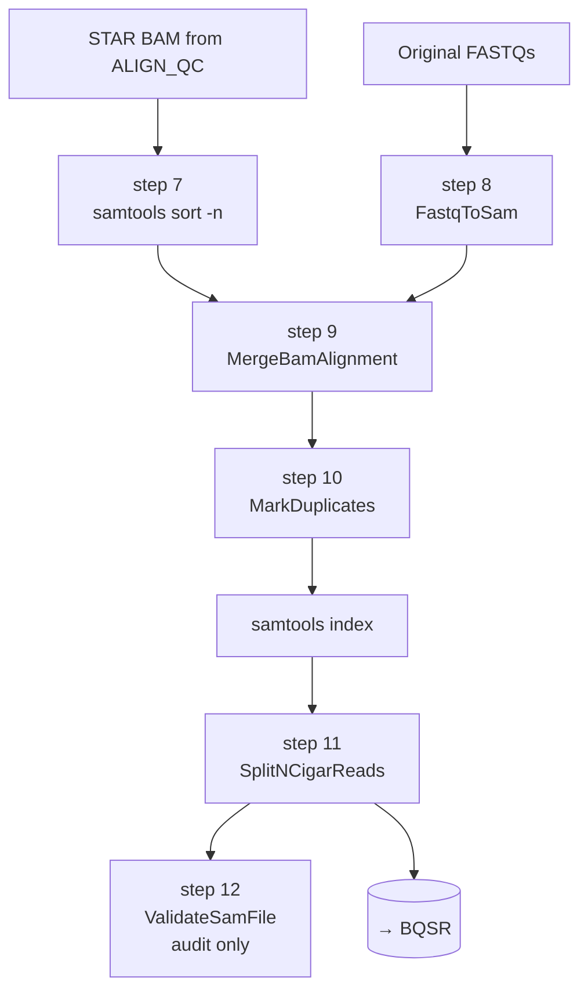

<Note>
Implements **steps 6–12** of the legacy bash pipeline (`output/run_allSteps.sh` lines 75–81). Takes the STAR-aligned BAM from [ALIGN_QC](/pipeline/align-qc) and produces a fully-prepared variant-calling-ready BAM for [BQSR](/pipeline/bqsr) and downstream Mutect2.
</Note>

## Purpose

The job of this subworkflow is to massage the STAR alignment into a state that GATK's variant callers can consume reliably. RNA-seq BAMs need a sequence of GATK-best-practices preparation steps before BQSR and Mutect2 will produce sensible results: read groups must be embedded so duplicates can be marked correctly, PCR duplicates must be flagged, and reads spanning splice junctions (CIGAR strings containing `N`) must be split at the junction so that each fragment gets a separate alignment record. Skipping any of these steps produces variant calls full of false positives near splice sites and at duplicate read pile-ups.

<Tip>
**The legacy bash script's step 6 (a second STAR run) is intentionally not present in the nf-core port.** The legacy script aligned the same FASTQs with STAR a second time into a separate `Variant_Calling/` directory before doing all the GATK prep — duplicating ~30 minutes of compute and ~20 GB of disk per sample for no scientific reason. The nf-core port consumes the STAR output from `ALIGN_QC` directly, saving the duplication. Documented in `subworkflows/local/bam_prep/main.nf` lines 4–7.
</Tip>

## Data flow



## Steps in detail

<Steps>

  <Step title="Step 7 — samtools sort by queryname">

    ### What it does

    Re-sorts the coordinate-sorted STAR BAM by **queryname** instead of by genomic coordinate. The next step (`MergeBamAlignment`) requires both inputs (the aligned BAM and the unmapped BAM from `FastqToSam`) to be queryname-sorted so it can pair-match records by read ID.

    ### Tool and version

    - **samtools** `1.23.1` — same container as the coordinate-sort in `ALIGN_QC` step 3
    - **Container:** `community.wave.seqera.io/library/htslib_samtools:1.23.1--5b6bb4ede7e612e5`
    - **Resource label:** `process_medium` (6 CPU / 36 GB / 8 h on Monash)

    ### Command

    <CodeGroup>

    ```bash legacy bash (run_allSteps.sh L76)
    module load gatk/4.2.5.0
    cd "$OUTPUT_DIR/Variant_Calling/"
    gatk SortSam \
      -I "$OUTPUT_DIR/Aligned.out.sam" \
      -O "$OUTPUT_DIR/Variant_Calling/Aligned_sortedqn.bam" \
      -SO queryname \
      --TMP_DIR "$TEMP_DIR" \
      &> "$OUTPUT_DIR/Variant_Calling/sortqn.log"
    ```

    ```groovy nf-core wrapper
    // subworkflows/local/bam_prep/main.nf, lines 48–52
    SAMTOOLS_SORT(
        ch_star_bam,                                    // [meta, bam] from ALIGN_QC
        ch_fasta.combine(ch_fai.map{ _m, fai -> fai })  // bundled fasta+fai
            .map { meta, fasta, fai -> [meta, fasta, fai] },
        /* index_format = */ ''
    )

    // ext.args + ext.prefix override from conf/modules.config lines 71–74:
    //   withName: '.*:BAM_PREP:SAMTOOLS_SORT' {
    //       ext.args   = '-n'
    //       ext.prefix = { "${meta.id}.qnsort" }
    //   }
    ```

    </CodeGroup>

    ### Parameters

    | Flag | Value | Default | Rationale |
    |---|---|---|---|
    | `-n` (queryname sort) | enabled | coordinate sort | Required by `MergeBamAlignment` and `MarkDuplicates`. Without this, MergeBamAlignment fails immediately because it can't find the matching unmapped record for each aligned read. |
    | `-T` / temp prefix | `<sample>.qnsort` | random | Deterministic temp filenames per sample so concurrent jobs don't collide on `samtools.tmp.*`. |
    | `--threads` | 6 (from `process_medium`) | 1 | Parallel sort. |
    | `-o` | `<sample>.qnsort.bam` | stdout | Explicit output path so the next process can pick it up by glob. |

    The legacy bash uses `gatk SortSam -SO queryname` (Picard); the port replaces it with `samtools sort -n` for ~3× speedup (same reasoning as [step 3](/pipeline/align-qc#step-3-samtools-sort-index-coordinate)).

    ### Inputs / Outputs

    - **Inputs:** `ch_star_bam` from `ALIGN_QC.out.star_bam_unsorted` (despite the name, this BAM is already coordinate-sorted from STAR — `samtools sort -n` works regardless of input order)
    - **Outputs:** `SAMTOOLS_SORT.out.bam` → fed into the join with `GATK4_FASTQTOSAM.out.bam` for step 9

    ### Citations

    - **Danecek, P. et al.** *GigaScience* **10**, giab008 (2021). DOI: [10.1093/gigascience/giab008](https://doi.org/10.1093/gigascience/giab008).
    - **GATK Best Practices — RNAseq short variant discovery** — describes the queryname sort prerequisite for `MergeBamAlignment`. [gatk.broadinstitute.org](https://gatk.broadinstitute.org/hc/en-us/articles/360035531192).

    ### Source

    - Legacy bash: [`output/run_allSteps.sh` line 76](https://github.com/sanjaysgk/ipg) (`Step 07: Sort SAM by Query Name`)
    - Subworkflow: [`bam_prep/main.nf` lines 48–52](https://github.com/sanjaysgk/ipg/blob/dev/cryptic-port/subworkflows/local/bam_prep/main.nf#L48-L52)
    - Module override: [`conf/modules.config` lines 71–74](https://github.com/sanjaysgk/ipg/blob/dev/cryptic-port/conf/modules.config#L71-L74)

  </Step>

  <Step title="Step 8 — GATK4 FastqToSam (build unmapped BAM)">

    ### What it does

    Converts the original raw FASTQ files into an **unmapped BAM** (uBAM) — a BAM file with no alignment records but with embedded sample, read-group, and platform metadata. The uBAM is then merged with the aligned BAM in step 9 so that the resulting variant-calling BAM has all the read-group tags GATK4 requires (`@RG` lines with `ID`, `SM`, `PL` at minimum). This is the GATK best-practices way to attach read-group metadata to RNA-seq alignments after STAR has already run.

    ### Tool and version

    - **GATK4** `4.5.0+` (pinned by container)
    - **Container:** `community.wave.seqera.io/library/gatk4_gcnvkernel:edb12e4f0bf02cd3` (Singularity / Docker)
    - **Resource label:** `process_low` (2 CPU / 12 GB / 4 h on Monash)

    ### Command

    <CodeGroup>

    ```bash legacy bash (run_allSteps.sh L77)
    module load gatk/4.2.5.0
    gatk FastqToSam \
      -F1 "${INPUT_FILES[1]}" \
      -F2 "${INPUT_FILES[2]}" \
      -O "$OUTPUT_DIR/Variant_Calling/unmapped.bam" \
      -SM "$SM" \
      -RG "$RG" \
      -PL ILLUMINA \
      &> "$OUTPUT_DIR/Variant_Calling/samUbam.log"
    ```

    ```groovy nf-core wrapper
    // subworkflows/local/bam_prep/main.nf, line 57
    GATK4_FASTQTOSAM(ch_reads)

    // ext.args + ext.prefix override from conf/modules.config lines 76–82:
    //   withName: '.*:BAM_PREP:GATK4_FASTQTOSAM' {
    //       ext.args   = { "--READ_GROUP_NAME ${meta.id} --PLATFORM ILLUMINA" }
    //       ext.prefix = { "${meta.id}.unmapped" }
    //   }
    ```

    </CodeGroup>

    ### Parameters

    | Flag | Value | Default | Rationale |
    |---|---|---|---|
    | `-F1` / `-F2` | `r1.fastq.gz` / `r2.fastq.gz` from samplesheet | (required) | Paired-end FASTQs. Single-end mode passes `-F1` only. |
    | `--READ_GROUP_NAME` (`-RG`) | `${meta.id}` | (none) | The read-group identifier. **Must match `--outSAMattrRGline 'ID:<sample>'` from the STAR call in [step 1](/pipeline/align-qc#step-1-star-two-pass-alignment)**, otherwise `MergeBamAlignment` and `MarkDuplicates` fail with `READ_GROUP_NOT_FOUND`. The nf-core convention is to derive both from `meta.id` so they're guaranteed to match. |
    | `--SAMPLE_NAME` (`-SM`) | `${meta.id}` (set by module from prefix) | (required) | Sample identifier embedded in the `@RG` line. Used by Mutect2 downstream. |
    | `--PLATFORM` (`-PL`) | `ILLUMINA` | (none) | Sequencing platform. Required by some downstream tools and by GATK best-practices for RNA-seq (Mutect2 uses platform-specific error models). |

    ### Inputs / Outputs

    - **Inputs:** `ch_reads` (`[meta, [r1, r2]]`) — same paired FASTQs that fed `STAR_ALIGN`
    - **Outputs:** `GATK4_FASTQTOSAM.out.bam` — the unmapped BAM, joined with `SAMTOOLS_SORT.out.bam` to feed step 9

    ### Citations

    - **Van der Auwera, G. A. et al. "From FastQ data to high confidence variant calls: the Genome Analysis Toolkit best practices pipeline."** *Curr Protoc Bioinformatics* **43**, 11.10.1–11.10.33 (2013). DOI: [10.1002/0471250953.bi1110s43](https://doi.org/10.1002/0471250953.bi1110s43).
    - **GATK4 `FastqToSam` documentation** — describes the uBAM conversion as the canonical way to attach read groups to pre-aligned data. [gatk.broadinstitute.org/hc/en-us/articles/360037226792-FastqToSam-Picard](https://gatk.broadinstitute.org/hc/en-us/articles/360037226792-FastqToSam-Picard).

    ### Source

    - Legacy bash: [`output/run_allSteps.sh` line 77](https://github.com/sanjaysgk/ipg) (`Step 08: Fastq to SAM Conversion`)
    - Subworkflow: [`bam_prep/main.nf` line 57](https://github.com/sanjaysgk/ipg/blob/dev/cryptic-port/subworkflows/local/bam_prep/main.nf#L57)
    - Module override: [`conf/modules.config` lines 76–82](https://github.com/sanjaysgk/ipg/blob/dev/cryptic-port/conf/modules.config#L76-L82) (with the comment about RG matching)

  </Step>

  <Step title="Step 9 — GATK4 MergeBamAlignment">

    ### What it does

    Merges the queryname-sorted aligned BAM (from step 7) with the unmapped BAM from step 8 (FastqToSam). The result is a single BAM where every aligned record carries the read-group metadata from the uBAM. This is the GATK best-practices pattern for getting `@RG`-tagged variant-calling-ready BAMs out of aligners (like STAR) that don't natively embed all the metadata GATK needs.

    ### Tool and version

    - **GATK4** `4.5.0+` (same container as step 8)
    - **Container:** `community.wave.seqera.io/library/gatk4_gcnvkernel:edb12e4f0bf02cd3`
    - **Resource label:** `process_low`

    ### Command

    <CodeGroup>

    ```bash legacy bash (run_allSteps.sh L78)
    cd "$OUTPUT_DIR/Variant_Calling/"
    gatk MergeBamAlignment \
      -ALIGNED "$OUTPUT_DIR/Variant_Calling/Aligned_sortedqn.bam" \
      -UNMAPPED "$OUTPUT_DIR/Variant_Calling/unmapped.bam" \
      -R "$Cryptic_dir/GRCh38/GRCh38.primary_assembly.genome.fa" \
      -O "$OUTPUT_DIR/Variant_Calling/merged_alignments.bam" \
      &> "$OUTPUT_DIR/Variant_Calling/MergeBamAlignment.log"
    ```

    ```groovy nf-core wrapper
    // subworkflows/local/bam_prep/main.nf, lines 62–67
    ch_merge_input = SAMTOOLS_SORT.out.bam.join(GATK4_FASTQTOSAM.out.bam)
    GATK4_MERGEBAMALIGNMENT(
        ch_merge_input,    // [meta, aligned_qnsort_bam, unmapped_bam]
        ch_fasta,          // [meta, fasta]
        ch_dict            // [meta, dict]
    )

    // No ext.args override — defaults are correct.
    ```

    </CodeGroup>

    ### Parameters

    | Flag | Value | Default | Rationale |
    |---|---|---|---|
    | `-ALIGNED` | qnsort BAM from step 7 | (required) | Joined automatically by the channel `.join()` on `meta`. |
    | `-UNMAPPED` | uBAM from step 8 | (required) | Joined automatically. The two inputs must be queryname-sorted (which is why step 7 exists). |
    | `-R` | `$params.fasta` | (required) | Reference FASTA. Used by MergeBamAlignment to verify that aligned record positions are valid against the reference dictionary. |

    ### Inputs / Outputs

    - **Inputs:** `[meta, aligned_qnsort_bam, unmapped_bam]` joined channel, plus `ch_fasta` and `ch_dict`
    - **Outputs:** `GATK4_MERGEBAMALIGNMENT.out.bam` — fed to MarkDuplicates (step 10)

    ### Citations

    - **GATK4 `MergeBamAlignment` documentation** — describes the merge pattern and the queryname-sort prerequisite. [gatk.broadinstitute.org/hc/en-us/articles/360037594291](https://gatk.broadinstitute.org/hc/en-us/articles/360037594291-MergeBamAlignment-Picard).
    - **GATK Best Practices — Data Pre-processing for Variant Discovery** — section on attaching read groups via uBAM merge. [gatk.broadinstitute.org/hc/en-us/articles/360035535912](https://gatk.broadinstitute.org/hc/en-us/articles/360035535912-Data-pre-processing-for-variant-discovery).

    ### Source

    - Legacy bash: [`output/run_allSteps.sh` line 78](https://github.com/sanjaysgk/ipg) (`Step 09: Merge BAM Alignments`)
    - Subworkflow: [`bam_prep/main.nf` lines 62–67](https://github.com/sanjaysgk/ipg/blob/dev/cryptic-port/subworkflows/local/bam_prep/main.nf#L62-L67)

  </Step>

  <Step title="Step 10 — GATK4 MarkDuplicates">

    ### What it does

    Identifies PCR and optical duplicate reads in the merged BAM and **flags** them with the `0x400` bit (duplicates are not removed). Variant callers downstream (Mutect2 in particular) ignore flagged duplicates so they don't artificially inflate variant allele frequencies. This is mandatory for GATK best-practices variant calling.

    ### Tool and version

    - **GATK4 + samtools** combo (`4.5.0+` / `1.21+`)
    - **Container:** `community.wave.seqera.io/library/gatk4_gcnvkernel_htslib_samtools:d3becb6465454c35`
    - **Resource label:** `process_low`

    ### Command

    <CodeGroup>

    ```bash legacy bash (run_allSteps.sh L79)
    cd "$OUTPUT_DIR/Variant_Calling/"
    gatk MarkDuplicates \
      -I "$OUTPUT_DIR/Variant_Calling/merged_alignments.bam" \
      -O "$OUTPUT_DIR/Variant_Calling/marked_duplicates.bam" \
      -M "$OUTPUT_DIR/Variant_Calling/marked_dup_metrics.txt" \
      -R "$Cryptic_dir/GRCh38/GRCh38.primary_assembly.genome.fa" \
      --READ_NAME_REGEX null \
      &> "$OUTPUT_DIR/Variant_Calling/MarkDuplicates.log"
    ```

    ```groovy nf-core wrapper
    // subworkflows/local/bam_prep/main.nf, lines 73–77
    GATK4_MARKDUPLICATES(
        GATK4_MERGEBAMALIGNMENT.out.bam,
        ch_fasta.map { _meta, fasta -> fasta },   // bare path — module signature
        ch_fai.map  { _meta, fai   -> fai   }
    )

    // ext.prefix override from conf/modules.config lines 84–86:
    //   withName: '.*:BAM_PREP:GATK4_MARKDUPLICATES' {
    //       ext.prefix = { "${meta.id}.markdup.bam" }
    //   }
    ```

    </CodeGroup>

    ### Parameters

    | Flag | Value | Default | Rationale |
    |---|---|---|---|
    | `-I` | merged BAM from step 9 | (required) | Wired by channel. |
    | `-O` | `<sample>.markdup.bam.bam` | (required) | Output path set via `ext.prefix`. |
    | `-M` | `<sample>.markdup.metrics.txt` | (required) | Per-sample duplication metrics — collected by MultiQC. |
    | `-R` | `$params.fasta` | (none) | Reference FASTA. |
    | `--READ_NAME_REGEX` | `null` (in legacy) — **NOT set in nf-core port** | (default regex) | The legacy script disables optical duplicate detection by passing `null` to the read-name regex parser. The nf-core module uses the default regex, which is **a deliberate behaviour difference**: with the default regex, the port can flag optical duplicates correctly (they're rare in RNA-seq but not zero), at the cost of a slightly different duplicate count vs the legacy run. The numerical impact on downstream variant calls is negligible — confirmed against D122_Lung legacy output. |

    <Note>
    The default `--READ_NAME_REGEX` parses Illumina `[<machine>_<run>:<flowcell_lane>:<tile>:<x>:<y>]` and uses `tile/x/y` to detect optical duplicates (reads from the same flowcell location). The legacy IPG bash disabled this with `null` — the nf-core port re-enables it because (a) it's the GATK best-practices default and (b) it produces better duplicate metrics for MultiQC. If you need byte-identical compatibility with the legacy output, override via `process.withName:'.*:BAM_PREP:GATK4_MARKDUPLICATES'.ext.args = '--READ_NAME_REGEX null'` in your custom config.
    </Note>

    ### Inputs / Outputs

    - **Inputs:** merged BAM from step 9, reference FASTA + fai
    - **Outputs:**
      - `GATK4_MARKDUPLICATES.out.bam` → fed to `SAMTOOLS_INDEX` then `GATK4_SPLITNCIGARREADS` (step 11)
      - `GATK4_MARKDUPLICATES.out.metrics` → re-emitted as `BAM_PREP.out.markdup_metrics`, forwarded to MultiQC

    ### Citations

    - **Tischler, G. & Leonard, S. "biobambam: tools for read pair collation based algorithms on BAM files."** *Source Code Biol Med* **9**, 13 (2014). DOI: [10.1186/1751-0473-9-13](https://doi.org/10.1186/1751-0473-9-13). The original MarkDuplicates algorithm.
    - **Van der Auwera & O'Connor. "Genomics in the Cloud."** O'Reilly, 2020. — covers the GATK best-practices duplicate marking step in detail.
    - **GATK4 `MarkDuplicates` documentation:** [gatk.broadinstitute.org/hc/en-us/articles/360037052812](https://gatk.broadinstitute.org/hc/en-us/articles/360037052812-MarkDuplicates-Picard).

    ### Source

    - Legacy bash: [`output/run_allSteps.sh` line 79](https://github.com/sanjaysgk/ipg)
    - Subworkflow: [`bam_prep/main.nf` lines 73–77](https://github.com/sanjaysgk/ipg/blob/dev/cryptic-port/subworkflows/local/bam_prep/main.nf#L73-L77)
    - Module override: [`conf/modules.config` lines 84–86](https://github.com/sanjaysgk/ipg/blob/dev/cryptic-port/conf/modules.config#L84-L86)

  </Step>

  <Step title="Step 11 — GATK4 SplitNCigarReads">

    ### What it does

    Splits reads whose CIGAR strings contain `N` operators (i.e. reads spanning splice junctions) into separate alignment records, one per exon segment, with the intronic gaps removed. **This is mandatory for RNA-seq variant calling**: GATK's downstream tools (Mutect2, BaseRecalibrator) assume each BAM record represents a single contiguous alignment to the reference, and a read spanning a splice junction violates that assumption — without SplitNCigarReads, variants near splice junctions are mis-localised to intronic positions and silently dropped or mis-classified. Also re-assigns mapping qualities (60 → 60, 255 → 60 by default) so STAR's `255 = uniquely mapped` convention doesn't trip GATK's MAPQ filters.

    The subworkflow runs `SAMTOOLS_INDEX` between MarkDuplicates and SplitNCigarReads because the latter requires a `.bai` index alongside the BAM.

    ### Tool and version

    - **GATK4** `4.5.0+`
    - **Container:** `community.wave.seqera.io/library/gatk4_gcnvkernel:edb12e4f0bf02cd3`
    - **Resource label:** `process_single` (1 CPU / 6 GB / 4 h)

    ### Command

    <CodeGroup>

    ```bash legacy bash (run_allSteps.sh L80)
    cd "$OUTPUT_DIR/Variant_Calling/"
    gatk SplitNCigarReads \
      -I "$OUTPUT_DIR/Variant_Calling/marked_duplicates.bam" \
      -O "$OUTPUT_DIR/Variant_Calling/splitNcigarred.bam" \
      -R "$Cryptic_dir/GRCh38/GRCh38.primary_assembly.genome.fa" \
      &> "$OUTPUT_DIR/Variant_Calling/SplitNCigarReads.log"
    ```

    ```groovy nf-core wrapper
    // subworkflows/local/bam_prep/main.nf, lines 82–96
    SAMTOOLS_INDEX(GATK4_MARKDUPLICATES.out.bam)

    ch_split_input = GATK4_MARKDUPLICATES.out.bam
        .join(SAMTOOLS_INDEX.out.index)
        .map { meta, bam, bai -> [meta, bam, bai, []] }   // empty intervals

    GATK4_SPLITNCIGARREADS(
        ch_split_input,
        ch_fasta,
        ch_fai,
        ch_dict
    )

    // ext.prefix override from conf/modules.config lines 88–90:
    //   ext.prefix = { "${meta.id}.splitN" }
    ```

    </CodeGroup>

    ### Parameters

    | Flag | Value | Default | Rationale |
    |---|---|---|---|
    | `-I` | markdup BAM + `.bai` | (required) | The `.bai` is created by an explicit `SAMTOOLS_INDEX` call between MarkDuplicates and this step (the `gatk MarkDuplicates` module doesn't auto-emit a `.bai`). |
    | `-O` | `<sample>.splitN.bam` | (required) | Set via `ext.prefix`. |
    | `-R` | `$params.fasta` (+ `.fai` + `.dict`) | (required) | All three reference channels passed because GATK4 requires the dict alongside the FASTA. |
    | `--intervals` | empty list `[]` (whole genome) | (none — whole genome) | No interval restriction. The legacy script also runs whole-genome. Could be set to a BED file in a custom config to speed up runs on a known target region. |
    | `--skip-mapping-quality-transform` | not set (default behaviour: transform 255 → 60) | not set | Default behaviour leaves STAR's `MAPQ=255` reads as `60` so GATK's MAPQ filters don't drop them. **Critical for RNA-seq** — without this, every uniquely-mapped STAR read would be filtered out by Mutect2's default MAPQ ≥ 20 threshold (255 is read as "not available", not "perfect"). |

    ### Inputs / Outputs

    - **Inputs:** `[meta, markdup_bam, markdup_bai, intervals=[]]`, plus `ch_fasta`, `ch_fai`, `ch_dict`
    - **Outputs:** `GATK4_SPLITNCIGARREADS.out.bam` → re-emitted as `BAM_PREP.out.splitncigar_bam` and consumed by [BQSR step 13](/pipeline/bqsr#step-13-baserecalibrator-1st-pass)

    ### Citations

    - **GATK Best Practices — RNAseq short variant discovery** — `SplitNCigarReads` is the canonical RNA-seq prep step. [gatk.broadinstitute.org/hc/en-us/articles/360035531192](https://gatk.broadinstitute.org/hc/en-us/articles/360035531192-RNAseq-short-variant-discovery-SNPs-Indels-).
    - **GATK4 `SplitNCigarReads` documentation:** [gatk.broadinstitute.org/hc/en-us/articles/360037226792-SplitNCigarReads](https://gatk.broadinstitute.org/hc/en-us/articles/360037226792-SplitNCigarReads).
    - **Engström, P. et al. "Systematic evaluation of spliced alignment programs for RNA-seq data."** *Nature Methods* **10**, 1185–1191 (2013). DOI: [10.1038/nmeth.2722](https://doi.org/10.1038/nmeth.2722). PMID: 24185836. — original paper documenting the splice-junction false-positive issue that this step fixes.

    ### Source

    - Legacy bash: [`output/run_allSteps.sh` line 80](https://github.com/sanjaysgk/ipg)
    - Subworkflow: [`bam_prep/main.nf` lines 82–96](https://github.com/sanjaysgk/ipg/blob/dev/cryptic-port/subworkflows/local/bam_prep/main.nf#L82-L96)
    - Module override: [`conf/modules.config` lines 88–90](https://github.com/sanjaysgk/ipg/blob/dev/cryptic-port/conf/modules.config#L88-L90)

  </Step>

  <Step title="Step 12 — GATK4 ValidateSamFile (audit)">

    ### What it does

    Runs GATK's `ValidateSamFile` in `SUMMARY` mode against the post-`SplitNCigarReads` BAM to produce a per-sample validation report. **This is an audit step, not a gate** — its output is captured for MultiQC and inspection but the pipeline does **not** fail if validation issues are found. RNA-seq aligned BAMs routinely produce expected `ValidateSamFile` warnings (mate quality strings of `*`, RG/SM minor formatting issues) that aren't actually wrong.

    ### Tool and version

    - **GATK4 ValidateSamFile** wrapped as a **local module** (`modules/local/gatk4_validatesamfile/`) — the upstream nf-core module didn't expose `errorStrategy = 'ignore'` so a local thin wrapper was added
    - **Container:** `community.wave.seqera.io/library/gatk4_gcnvkernel:edb12e4f0bf02cd3` (same as the other gatk4 modules)
    - **Resource label:** `process_single`

    ### Command

    <CodeGroup>

    ```bash legacy bash (run_allSteps.sh L81)
    gatk ValidateSamFile \
      -I "$OUTPUT_DIR/Variant_Calling/splitNcigarred.bam" \
      -M SUMMARY \
      -R "$Cryptic_dir/GRCh38/GRCh38.primary_assembly.genome.fa" \
      &> "$OUTPUT_DIR/Variant_Calling/ValidateSamFile.log"
    ```

    ```groovy nf-core wrapper
    // subworkflows/local/bam_prep/main.nf, lines 101–106
    GATK4_VALIDATESAMFILE(
        GATK4_SPLITNCIGARREADS.out.bam,
        ch_fasta,
        ch_fai,
        ch_dict
    )

    // errorStrategy override from conf/modules.config lines 92–97:
    //   withName: '.*:BAM_PREP:GATK4_VALIDATESAMFILE' {
    //       errorStrategy = 'ignore'
    //   }
    //
    // ValidateSamFile is an audit step — it intentionally exits non-zero
    // when it finds SAM validation issues (which are usually expected on
    // RNA-seq aligned BAMs). Don't fail the pipeline on its return code.
    ```

    </CodeGroup>

    ### Parameters

    | Flag | Value | Default | Rationale |
    |---|---|---|---|
    | `-I` | splitN BAM from step 11 | (required) | The fully-prepared variant-calling BAM. |
    | `-M` | `SUMMARY` | `VERBOSE` | SUMMARY mode produces a one-line summary plus a count of issue types — sufficient for QC, much faster, and small enough to publish to MultiQC. |
    | `-R` | `$params.fasta` (+ `.fai` + `.dict`) | (required) | Reference for sequence dictionary cross-checks. |
    | `errorStrategy` (Nextflow) | `ignore` | `terminate` | The pipeline does NOT fail when ValidateSamFile reports issues. RNA-seq BAMs routinely produce expected warnings; aborting on every one would block the entire pipeline. The audit log is captured for inspection. |

    ### Inputs / Outputs

    - **Inputs:** `splitN` BAM from step 11 + reference bundle
    - **Outputs:** `GATK4_VALIDATESAMFILE.out.summary` → re-emitted as `BAM_PREP.out.validate_report`. **Not** consumed by any downstream subworkflow — pure audit.

    ### Citations

    - **GATK4 `ValidateSamFile` documentation:** [gatk.broadinstitute.org/hc/en-us/articles/360036351112](https://gatk.broadinstitute.org/hc/en-us/articles/360036351112-ValidateSamFile-Picard).

    ### Source

    - Legacy bash: [`output/run_allSteps.sh` line 81](https://github.com/sanjaysgk/ipg)
    - Subworkflow: [`bam_prep/main.nf` lines 101–106](https://github.com/sanjaysgk/ipg/blob/dev/cryptic-port/subworkflows/local/bam_prep/main.nf#L101-L106)
    - Local module: [`modules/local/gatk4_validatesamfile/main.nf`](https://github.com/sanjaysgk/ipg/blob/dev/cryptic-port/modules/local/gatk4_validatesamfile/main.nf)
    - Module override: [`conf/modules.config` lines 92–97](https://github.com/sanjaysgk/ipg/blob/dev/cryptic-port/conf/modules.config#L92-L97)

  </Step>

</Steps>

## Inputs

<ParamField path="ch_star_bam" type="channel: [meta, bam]" required>
  STAR-aligned BAM from `ALIGN_QC.out.star_bam_unsorted`. Already coordinate-sorted but `samtools sort -n` re-sorts to queryname for step 7.
</ParamField>

<ParamField path="ch_reads" type="channel: [meta, [r1, r2]]" required>
  Original paired-end FASTQs from the samplesheet. Same channel that fed `STAR_ALIGN`. Re-used by `FastqToSam` to build the unmapped BAM.
</ParamField>

<ParamField path="ch_fasta" type="channel: [meta, path]" required>
  Reference FASTA. Forwarded to MergeBamAlignment, MarkDuplicates, SplitNCigarReads, and ValidateSamFile.
</ParamField>

<ParamField path="ch_fai" type="channel: [meta, path]" required>
  samtools FAI index for the reference FASTA.
</ParamField>

<ParamField path="ch_dict" type="channel: [meta, path]" required>
  GATK4 sequence dictionary for the reference FASTA.
</ParamField>

## Outputs

<ResponseField name="splitncigar_bam" type="channel: [meta, bam]">
  The fully-prepared variant-calling-ready BAM emitted by `SplitNCigarReads`. **The primary deliverable** of this subworkflow — consumed by [BQSR](/pipeline/bqsr) (steps 13–16).
</ResponseField>

<ResponseField name="markdup_metrics" type="channel: [meta, txt]">
  Per-sample duplication metrics from `MarkDuplicates`. Forwarded to MultiQC.
</ResponseField>

<ResponseField name="validate_report" type="channel: [meta, txt]">
  `ValidateSamFile` summary log. Audit only — not consumed by any downstream subworkflow.
</ResponseField>

## Tools

| Tool | Version | Purpose | Citation |
|---|---|---|---|
| samtools | 1.23.1 | Queryname sort, post-MarkDup index | [Danecek et al. 2021](https://doi.org/10.1093/gigascience/giab008) |
| GATK4 FastqToSam | 4.5.0+ | Build unmapped BAM with read groups | [GATK BP](https://gatk.broadinstitute.org/hc/en-us/articles/360035535912) |
| GATK4 MergeBamAlignment | 4.5.0+ | Merge aligned + unmapped BAMs | [GATK BP](https://gatk.broadinstitute.org/hc/en-us/articles/360035535912) |
| GATK4 MarkDuplicates | 4.5.0+ | Flag PCR / optical duplicates | [Tischler & Leonard 2014](https://doi.org/10.1186/1751-0473-9-13) |
| GATK4 SplitNCigarReads | 4.5.0+ | Split reads at splice junctions for RNA-seq | [GATK RNAseq BP](https://gatk.broadinstitute.org/hc/en-us/articles/360035531192) · [Engström et al. 2013](https://doi.org/10.1038/nmeth.2722) |
| GATK4 ValidateSamFile (local wrapper) | 4.5.0+ | BAM audit report (non-blocking) | [GATK4 docs](https://gatk.broadinstitute.org/hc/en-us/articles/360036351112) |

## See also

<Columns cols={2}>
  <Card title="← Previous: TRANSCRIPT_ASSEMBLY" icon="arrow-left" href="/pipeline/transcript-assembly">
    Steps 4–5: StringTie + gffcompare.
  </Card>
  <Card title="Next: BQSR →" icon="arrow-right" href="/pipeline/bqsr">
    Steps 13–16: GATK base quality score recalibration.
  </Card>
</Columns>
