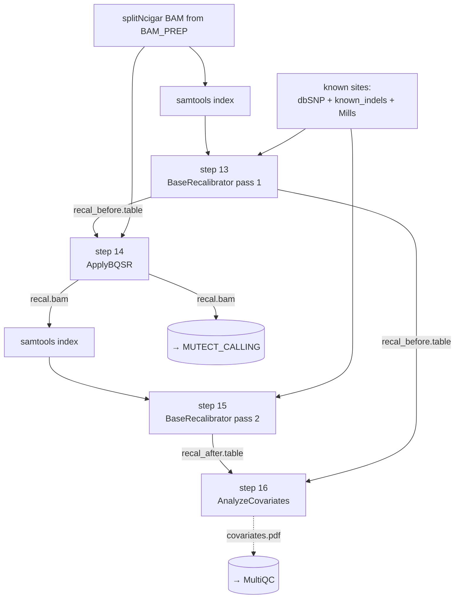

<Note>
Implements **steps 13–16** of the legacy bash pipeline (`output/run_allSteps.sh` lines 82–85). Takes the post-`SplitNCigarReads` BAM from [BAM_PREP](/pipeline/bam-prep) and produces a base-quality-recalibrated BAM ready for [Mutect2 variant calling](/pipeline/mutect-calling), plus a QC PDF showing the recalibration's effect.
</Note>

## Purpose

Sequencer base quality scores systematically over- or under-estimate the true error rate at each base call — the magnitude of the bias depends on the sequencing context (machine cycle, dinucleotide, read orientation). **Base Quality Score Recalibration (BQSR)** uses a database of known variant sites to model this bias empirically and produce corrected quality scores. Mutect2 (and every other GATK4 variant caller) uses these recalibrated scores when computing the likelihood of each variant call, so skipping BQSR materially increases the false-positive rate of downstream variant calls — especially at low-allele-frequency sites which are exactly the cryptic-peptide-relevant calls.

The IPG pipeline runs BQSR in **two passes**, matching the GATK best-practices QC pattern: pass 1 builds a recalibration table from the input BAM and applies it; pass 2 builds a second table from the *already-recalibrated* BAM. Comparing the two tables (via `AnalyzeCovariates`) shows whether the recalibration actually flattened the quality bias — if pass 2's residuals are much smaller than pass 1's, BQSR worked.

<Tip>
**Three known-sites VCFs are folded into a single list-channel** instead of being passed individually. The legacy bash script passes `--known-sites <vcf>` three times (one for dbSNP138, one for Broad known indels, one for Mills + 1000G). The nf-core port collects all three into `ch_known_sites = [meta, [dbsnp, known_indels, mills]]` and the upstream `gatk4/baserecalibrator` module expands the list automatically. See `bqsr/main.nf` lines 10–12.
</Tip>

## Data flow



## Steps in detail

<Steps>

  <Step title="Step 13 — BaseRecalibrator (first pass)">

    ### What it does

    Walks the input BAM, looks at every base call that **does not** match a known variant in dbSNP138 / known indels / Mills, and builds a model of how the called quality score relates to the empirical mismatch rate, broken down by read group, machine cycle, and dinucleotide context. The output is a `recal_before.table` file that captures this model per-sample. The table is then applied in step 14 to produce a corrected BAM.

    ### Tool and version

    - **GATK4** `4.5.0+` (via the wave container)
    - **Container:** `community.wave.seqera.io/library/gatk4_gcnvkernel:edb12e4f0bf02cd3`
    - **Resource label:** `process_low` (2 CPU / 12 GB / 4 h on Monash)

    ### Command

    <CodeGroup>

    ```bash legacy bash (run_allSteps.sh L82)
    gatk BaseRecalibrator \
      -I "$OUTPUT_DIR/Variant_Calling/splitNcigarred.bam" \
      -O "$OUTPUT_DIR/Variant_Calling/${SAMPLE_NAME}_recal_data.table" \
      -R "$Cryptic_dir/GRCh38/GRCh38.primary_assembly.genome.fa" \
      --known-sites "$Cryptic_dir/.../resources_broad_hg38_v0_Homo_sapiens_assembly38.known_indels.vcf.gz" \
      --known-sites "$Cryptic_dir/.../resources_broad_hg38_v0_Homo_sapiens_assembly38.dbsnp138.vcf" \
      --known-sites "$Cryptic_dir/.../resources_broad_hg38_v0_Mills_and_1000G_gold_standard.indels.hg38.vcf.gz" \
      &> "$OUTPUT_DIR/Variant_Calling/BaseRecalibrator.log"
    ```

    ```groovy nf-core wrapper
    // subworkflows/local/bqsr/main.nf, lines 41–57
    SAMTOOLS_INDEX_INPUT(ch_input_bam)

    ch_bam_bai_in = ch_input_bam
        .join(SAMTOOLS_INDEX_INPUT.out.index)
        .map { meta, bam, bai -> [meta, bam, bai, []] }   // empty intervals

    BASERECALIBRATOR_FIRST(             // alias of GATK4_BASERECALIBRATOR
        ch_bam_bai_in,
        ch_fasta,
        ch_fai,
        ch_dict,
        ch_known_sites,                  // [meta, [dbsnp, known_indels, mills]]
        ch_known_sites_tbi
    )

    // ext.prefix override from conf/modules.config lines 113–115:
    //   ext.prefix = { "${meta.id}.recal_before" }
    ```

    </CodeGroup>

    ### Parameters

    | Flag | Value | Default | Rationale |
    |---|---|---|---|
    | `-I` | splitNcigar BAM + `.bai` | (required) | The fully prepared BAM from `BAM_PREP`. Indexed by an explicit `SAMTOOLS_INDEX` call (aliased `SAMTOOLS_INDEX_INPUT`) since `MarkDuplicates` doesn't auto-index its output. |
    | `-O` | `<sample>.recal_before.table` | (required) | Distinct prefix is critical: BaseRecalibrator runs **twice** in this subworkflow (alias-imported as `BASERECALIBRATOR_FIRST` and `BASERECALIBRATOR_SECOND`). Without `ext.prefix`, both calls would write `<sample>.table` and AnalyzeCovariates would stage two files with the same name into one work directory and crash. |
    | `-R` | `$params.fasta` (+ `.fai` + `.dict`) | (required) | Reference bundle. |
    | `--known-sites` (×3) | `[dbsnp138, known_indels, Mills]` | (required) | The Broad hg38 v0 bundle. The three VCFs are passed as a single list channel — see the Tip at the top of this page. |
    | `--intervals` | empty list `[]` | whole genome | No interval restriction. The legacy script also runs whole-genome. |

    ### Inputs / Outputs

    - **Inputs:** `splitncigar_bam` from `BAM_PREP`, reference bundle, `ch_known_sites` (list), `ch_known_sites_tbi` (list)
    - **Outputs:** `BASERECALIBRATOR_FIRST.out.table` → fed to `GATK4_APPLYBQSR` (step 14) AND to `GATK4_ANALYZECOVARIATES` (step 16) as the "before" table

    ### Citations

    - **DePristo, M. A. et al. "A framework for variation discovery and genotyping using next-generation DNA sequencing data."** *Nat Genet* **43**, 491–498 (2011). DOI: [10.1038/ng.806](https://doi.org/10.1038/ng.806). PMID: 21478889. — original BQSR algorithm.
    - **GATK Best Practices — Data Pre-processing for Variant Discovery** — BQSR section. [gatk.broadinstitute.org/hc/en-us/articles/360035535912](https://gatk.broadinstitute.org/hc/en-us/articles/360035535912).
    - **GATK4 `BaseRecalibrator` documentation:** [gatk.broadinstitute.org/hc/en-us/articles/360037593511](https://gatk.broadinstitute.org/hc/en-us/articles/360037593511-BaseRecalibrator).

    ### Source

    - Legacy bash: [`output/run_allSteps.sh` line 82](https://github.com/sanjaysgk/ipg)
    - Subworkflow: [`bqsr/main.nf` lines 41–57](https://github.com/sanjaysgk/ipg/blob/dev/cryptic-port/subworkflows/local/bqsr/main.nf#L41-L57)
    - Module override: [`conf/modules.config` lines 113–115](https://github.com/sanjaysgk/ipg/blob/dev/cryptic-port/conf/modules.config#L113-L115)

  </Step>

  <Step title="Step 14 — ApplyBQSR">

    ### What it does

    Reads the input BAM and the recalibration table from step 13, replaces every base quality score with its bias-corrected value, and writes the corrected BAM. The output is the **fully prepared variant-calling BAM** that Mutect2 will consume in [step 17](/pipeline/mutect-calling#step-17-mutect2). Quality scores are the only thing that changes — read sequences, mapping positions, CIGAR strings, read groups, and duplicate flags are all preserved.

    ### Tool and version

    - **GATK4** `4.5.0+` (same container)
    - **Container:** `community.wave.seqera.io/library/gatk4_gcnvkernel:edb12e4f0bf02cd3`
    - **Resource label:** `process_low`

    ### Command

    <CodeGroup>

    ```bash legacy bash (run_allSteps.sh L83)
    gatk ApplyBQSR \
      -R "$Cryptic_dir/GRCh38/GRCh38.primary_assembly.genome.fa" \
      -I "$OUTPUT_DIR/Variant_Calling/splitNcigarred.bam" \
      --bqsr-recal-file "$OUTPUT_DIR/Variant_Calling/${SAMPLE_NAME}_recal_data.table" \
      -O "$OUTPUT_DIR/Variant_Calling/${SAMPLE_NAME}_score_corrected.bam" \
      &> "$OUTPUT_DIR/Variant_Calling/ApplyBQSR.log"
    ```

    ```groovy nf-core wrapper
    // subworkflows/local/bqsr/main.nf, lines 62–72
    ch_applybqsr_input = ch_input_bam
        .join(SAMTOOLS_INDEX_INPUT.out.index)
        .join(BASERECALIBRATOR_FIRST.out.table)
        .map { meta, bam, bai, table -> [meta, bam, bai, table, []] }

    GATK4_APPLYBQSR(
        ch_applybqsr_input,
        ch_fasta.map { _meta, fasta -> fasta },   // bare path
        ch_fai.map   { _meta, fai   -> fai   },
        ch_dict.map  { _meta, dict  -> dict  }
    )

    // ext.suffix + ext.prefix override from conf/modules.config lines 105–108:
    //   withName: '.*:BQSR:GATK4_APPLYBQSR' {
    //       ext.suffix = 'bam'
    //       ext.prefix = { "${meta.id}.recal" }
    //   }
    ```

    </CodeGroup>

    ### Parameters

    | Flag | Value | Default | Rationale |
    |---|---|---|---|
    | `-I` | splitNcigar BAM + `.bai` | (required) | Same input as step 13 — BQSR is always applied to the original BAM, not to a re-aligned one. |
    | `--bqsr-recal-file` | `<sample>.recal_before.table` from step 13 | (required) | Joined automatically via `.join()` on `meta`. |
    | `-O` | `<sample>.recal.bam` | (required) | The recalibrated BAM. The legacy script names it `_score_corrected.bam`; the port uses `<sample>.recal.bam` to match the nf-core convention used elsewhere in the pipeline. |
    | `ext.suffix = 'bam'` | `bam` | `cram` | **Critical override.** The upstream `gatk4/applybqsr` module defaults to CRAM output. CRAM is more space-efficient but the downstream `SAMTOOLS_INDEX_RECAL` and Mutect2 chain in this pipeline expect `.bam`. Without this override, the entire pipeline silently fails one process later. Documented in `conf/modules.config:103-104`. |
    | `-R` | `$params.fasta` | (required) | Reference bundle. |

    ### Inputs / Outputs

    - **Inputs:** splitNcigar BAM + `.bai` + `recal_before.table` (joined channel), reference bundle
    - **Outputs:** `GATK4_APPLYBQSR.out.bam` → re-emitted as `BQSR.out.recal_bam`. Also indexed by `SAMTOOLS_INDEX_RECAL` and joined into `recal_bam_bai` for `MUTECT_CALLING`.

    ### Citations

    - **GATK4 `ApplyBQSR` documentation:** [gatk.broadinstitute.org/hc/en-us/articles/360036726891](https://gatk.broadinstitute.org/hc/en-us/articles/360036726891-ApplyBQSR).

    ### Source

    - Legacy bash: [`output/run_allSteps.sh` line 83](https://github.com/sanjaysgk/ipg)
    - Subworkflow: [`bqsr/main.nf` lines 62–72](https://github.com/sanjaysgk/ipg/blob/dev/cryptic-port/subworkflows/local/bqsr/main.nf#L62-L72)
    - Module override: [`conf/modules.config` lines 105–108](https://github.com/sanjaysgk/ipg/blob/dev/cryptic-port/conf/modules.config#L105-L108) (CRAM → BAM forcing)

  </Step>

  <Step title="Step 15 — BaseRecalibrator (second pass, on recalibrated BAM)">

    ### What it does

    Re-runs `BaseRecalibrator` against the **already-recalibrated** BAM from step 14, producing a `recal_after.table`. This is **not** a second round of recalibration applied to the data — the corrected BAM is what the variant caller will see — it's an **audit step** so AnalyzeCovariates (step 16) can compare the before / after tables and verify that BQSR actually flattened the quality bias.

    ### Tool and version

    Identical to step 13. The two `BaseRecalibrator` calls are alias-imported in the subworkflow as `BASERECALIBRATOR_FIRST` and `BASERECALIBRATOR_SECOND` so they show up as distinct processes in the Nextflow graph.

    ### Command

    <CodeGroup>

    ```bash legacy bash (run_allSteps.sh L84)
    gatk BaseRecalibrator \
      -I "$OUTPUT_DIR/Variant_Calling/${SAMPLE_NAME}_score_corrected.bam" \
      -O "$OUTPUT_DIR/Variant_Calling/${SAMPLE_NAME}_recal_data_after.table" \
      -R "$Cryptic_dir/GRCh38/GRCh38.primary_assembly.genome.fa" \
      --known-sites "..." --known-sites "..." --known-sites "..." \
      &> "$OUTPUT_DIR/Variant_Calling/BaseRecalibrator_2.log"
    ```

    ```groovy nf-core wrapper
    // subworkflows/local/bqsr/main.nf, lines 77–93
    SAMTOOLS_INDEX_RECAL(GATK4_APPLYBQSR.out.bam)

    ch_bam_bai_recal = GATK4_APPLYBQSR.out.bam
        .join(SAMTOOLS_INDEX_RECAL.out.index)
        .map { meta, bam, bai -> [meta, bam, bai, []] }

    BASERECALIBRATOR_SECOND(             // alias of GATK4_BASERECALIBRATOR
        ch_bam_bai_recal,
        ch_fasta,
        ch_fai,
        ch_dict,
        ch_known_sites,
        ch_known_sites_tbi
    )

    // ext.prefix override from conf/modules.config lines 116–118:
    //   ext.prefix = { "${meta.id}.recal_after" }
    ```

    </CodeGroup>

    ### Parameters

    Identical to step 13 except `-I` points at the recalibrated BAM, and `ext.prefix` writes to `<sample>.recal_after.table` instead of `<sample>.recal_before.table`. The distinct prefixes are essential — without them, AnalyzeCovariates would stage two `<sample>.table` files into one work directory and crash.

    ### Inputs / Outputs

    - **Inputs:** recalibrated BAM (`recal.bam`) + its `.bai` from `SAMTOOLS_INDEX_RECAL`, reference bundle, known-sites VCFs
    - **Outputs:** `BASERECALIBRATOR_SECOND.out.table` → fed to `GATK4_ANALYZECOVARIATES` (step 16) as the "after" table

    ### Source

    - Legacy bash: [`output/run_allSteps.sh` line 84](https://github.com/sanjaysgk/ipg)
    - Subworkflow: [`bqsr/main.nf` lines 77–93](https://github.com/sanjaysgk/ipg/blob/dev/cryptic-port/subworkflows/local/bqsr/main.nf#L77-L93)
    - Module override: [`conf/modules.config` lines 116–118](https://github.com/sanjaysgk/ipg/blob/dev/cryptic-port/conf/modules.config#L116-L118)

  </Step>

  <Step title="Step 16 — AnalyzeCovariates (before/after QC plot)">

    ### What it does

    Reads the `recal_before.table` from step 13 and the `recal_after.table` from step 15 and produces a multi-page QC PDF showing how each covariate (read group, machine cycle, dinucleotide) was corrected by BQSR. A successful BQSR run shows the "after" curves much closer to the diagonal y=x line than the "before" curves. The PDF is forwarded to MultiQC for the per-sample QC dashboard.

    ### Tool and version

    - **GATK4** `4.5.0+` (uses the embedded R + ggplot2 for plot rendering)
    - **Container:** `community.wave.seqera.io/library/gatk4_gcnvkernel:edb12e4f0bf02cd3`
    - **Resource label:** `process_single` (1 CPU / 6 GB / 4 h)

    ### Command

    <CodeGroup>

    ```bash legacy bash (run_allSteps.sh L85)
    module load R/3.5.0
    gatk AnalyzeCovariates \
      -before "$OUTPUT_DIR/Variant_Calling/${SAMPLE_NAME}_recal_data.table" \
      -after  "$OUTPUT_DIR/Variant_Calling/${SAMPLE_NAME}_recal_data_after.table" \
      -plots  "$OUTPUT_DIR/Variant_Calling/${SAMPLE_NAME}_AnalyzeCovariates.pdf"
    ```

    ```groovy nf-core wrapper
    // subworkflows/local/bqsr/main.nf, lines 101–105
    ch_covariates_input = BASERECALIBRATOR_FIRST.out.table
        .join(BASERECALIBRATOR_SECOND.out.table)
        .map { meta, before, after -> [meta, before, after, []] }

    GATK4_ANALYZECOVARIATES(ch_covariates_input)

    // errorStrategy override from conf/modules.config lines 124–126:
    //   withName: '.*:BQSR:GATK4_ANALYZECOVARIATES' {
    //       errorStrategy = 'ignore'
    //   }
    ```

    </CodeGroup>

    ### Parameters

    | Flag | Value | Default | Rationale |
    |---|---|---|---|
    | `-before` | `<sample>.recal_before.table` | (required) | First-pass table from step 13. |
    | `-after` | `<sample>.recal_after.table` | (required) | Second-pass table from step 15. |
    | `-additional-tables` (3rd slot) | empty list `[]` | (none) | The module signature accepts a third optional table — used when comparing three different recalibration runs. The IPG pipeline only does two, so the third slot is empty. |
    | `errorStrategy` (Nextflow) | `ignore` | `terminate` | **Important:** the PDF rendering depends on R + ggplot2 being available inside the container. The wave gatk4 container bundles them, but custom containers (or future image rebuilds) may not — and the QC CSV data is still emitted even when the R script fails. The recalibrated BAM is the actual deliverable; the PDF is QC-only, so we don't fail the pipeline on a broken plot. Documented in `conf/modules.config:120-126`. |

    ### Inputs / Outputs

    - **Inputs:** `[meta, before_table, after_table, additional_table=[]]`
    - **Outputs:** `GATK4_ANALYZECOVARIATES.out.plots` → re-emitted as `BQSR.out.covariates_pdf`. Forwarded to MultiQC. Audit-only — not consumed by any downstream subworkflow.

    ### Citations

    - **GATK4 `AnalyzeCovariates` documentation:** [gatk.broadinstitute.org/hc/en-us/articles/360037226852](https://gatk.broadinstitute.org/hc/en-us/articles/360037226852-AnalyzeCovariates).

    ### Source

    - Legacy bash: [`output/run_allSteps.sh` line 85](https://github.com/sanjaysgk/ipg)
    - Subworkflow: [`bqsr/main.nf` lines 101–105](https://github.com/sanjaysgk/ipg/blob/dev/cryptic-port/subworkflows/local/bqsr/main.nf#L101-L105)
    - Module override: [`conf/modules.config` lines 120–126](https://github.com/sanjaysgk/ipg/blob/dev/cryptic-port/conf/modules.config#L120-L126)

  </Step>

</Steps>

## Inputs

<ParamField path="ch_input_bam" type="channel: [meta, bam]" required>
  Post-`SplitNCigarReads` BAM from `BAM_PREP.out.splitncigar_bam`.
</ParamField>

<ParamField path="ch_fasta" type="channel: [meta, path]" required>
  Reference FASTA.
</ParamField>

<ParamField path="ch_fai" type="channel: [meta, path]" required>
  samtools FAI index.
</ParamField>

<ParamField path="ch_dict" type="channel: [meta, path]" required>
  GATK4 sequence dictionary.
</ParamField>

<ParamField path="ch_known_sites" type="channel: [meta, [vcf, vcf, vcf]]" required>
  List channel carrying the three known-sites VCFs: dbSNP138, Broad known indels, and Mills + 1000G gold standard. See [Known sites parameters](/api-reference/parameters/known-sites).
</ParamField>

<ParamField path="ch_known_sites_tbi" type="channel: [meta, [tbi, tbi, tbi]]" required>
  Tabix indices for the three known-sites VCFs in the same order as `ch_known_sites`.
</ParamField>

## Outputs

<ResponseField name="recal_bam" type="channel: [meta, bam]">
  Recalibrated BAM from `ApplyBQSR`. The primary deliverable.
</ResponseField>

<ResponseField name="recal_bai" type="channel: [meta, bai]">
  Index for the recalibrated BAM, generated by `SAMTOOLS_INDEX_RECAL`.
</ResponseField>

<ResponseField name="recal_bam_bai" type="channel: [meta, bam, bai]">
  Joined tuple of the recalibrated BAM and its index. **The form `MUTECT_CALLING` consumes.**
</ResponseField>

<ResponseField name="before_table" type="channel: [meta, table]">
  First-pass BaseRecalibrator output. Audit / debugging.
</ResponseField>

<ResponseField name="after_table" type="channel: [meta, table]">
  Second-pass BaseRecalibrator output. Audit / debugging.
</ResponseField>

<ResponseField name="covariates_pdf" type="channel: [meta, pdf]">
  AnalyzeCovariates QC plot. Forwarded to MultiQC. Optional — rendering can fail without breaking the pipeline.
</ResponseField>

## Tools

| Tool | Version | Purpose | Citation |
|---|---|---|---|
| GATK4 BaseRecalibrator (×2 aliases) | 4.5.0+ | Build per-sample base quality recalibration model | [DePristo et al. 2011](https://doi.org/10.1038/ng.806) |
| GATK4 ApplyBQSR | 4.5.0+ | Apply the recalibration model to base qualities | [GATK4 docs](https://gatk.broadinstitute.org/hc/en-us/articles/360036726891) |
| GATK4 AnalyzeCovariates | 4.5.0+ | Render before/after QC plot | [GATK4 docs](https://gatk.broadinstitute.org/hc/en-us/articles/360037226852) |
| samtools index (×2 aliases) | 1.23.1 | BAM indexing for the input + recalibrated BAMs | [Danecek et al. 2021](https://doi.org/10.1093/gigascience/giab008) |

## See also

<Columns cols={2}>
  <Card title="← Previous: BAM_PREP" icon="arrow-left" href="/pipeline/bam-prep">
    Steps 6–12: queryname sort, FastqToSam, MergeBamAlignment, MarkDuplicates, SplitNCigarReads, ValidateSamFile.
  </Card>
  <Card title="Next: MUTECT_CALLING →" icon="arrow-right" href="/pipeline/mutect-calling">
    Steps 17–23: Mutect2, contamination correction, filter, curate.
  </Card>
</Columns>
