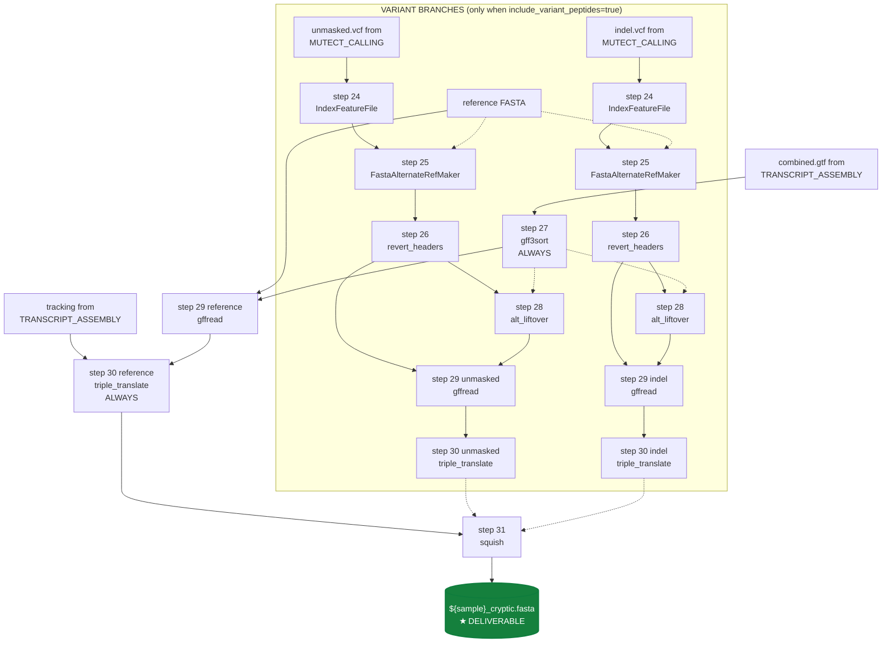

<Note>
Implements **steps 24–31** of the legacy bash pipeline (`output/run_allSteps.sh` lines 93–100). This is the **final** subworkflow and the one that produces the pipeline's primary deliverable: `${sample}_cryptic.fasta`. Five of the eight steps wrap **kescull C tools** authored by Katherine E. Scull for the original 2021 IPG paper.
</Note>

<Warning>
**This subworkflow's behaviour depends on `params.include_variant_peptides`** — a global pipeline-level flag (default `false`). Read the [variant-peptide-mode](/background/variant-peptide-mode) explainer **before** running this pipeline on a tumor cohort.

| `params.include_variant_peptides` | What runs | When to use |
|---|---|---|
| **`false`** (default) | Reference-only branch: `gff3sort → gffread → triple_translate → squish`. Steps 24, 25, 26, 28 are skipped entirely. Steps 29 and 30 run **once** (reference branch only). The cryptic FASTA contains peptides from novel ORFs, alt-splicing, and intronic / intergenic translation. **Matches legacy Scull et al. 2021 / D122_Lung output exactly.** Saves ~10 process executions and ~3× compute per sample. | Normal tissue, cell lines, lightly-mutated samples, **and any sample where you want a faithful reproduction of the legacy IPG paper protocol**. |
| **`true`** | Reference branch + **both variant branches** (unmasked + indel). Steps 24–28 all run, steps 29 and 30 run **three times** (one per branch), and step 31's `squish` merges all three protein databases. The cryptic FASTA additionally contains SNV-substitution and indel-derived peptides. | Tumor tissue, hypermutated samples, and any case where you want neoantigen-class peptides in the MS/MS search space — **and you have read the [tumor-only Mutect2 caveat](/pipeline/mutect-calling#variant-calling-discipline)**. This is an **extension** over the published 2021 IPG protocol; the legacy bash script bizarrely produced the variant branches but never used them. |

The flag is **global**, not per-sample. Mixing samples with different cryptic-DB intents in one run is confusing and error-prone — run the pipeline twice if you need both modes for a mixed cohort. See `db_construct/main.nf:11-14`.
</Warning>

## Purpose

This subworkflow is where the actual **cryptic peptide database** is constructed. It takes (a) the StringTie + gffcompare assembly from [TRANSCRIPT_ASSEMBLY](/pipeline/transcript-assembly), (b) optionally the curated VCFs from [MUTECT_CALLING](/pipeline/mutect-calling), and produces a **single FASTA file per sample** containing every candidate cryptic peptide for downstream MS/MS database search.

The reference branch (always runs) produces peptides from **novel transcripts the assembler discovered** — alt-spliced isoforms, intronic ORFs, intergenic ORFs, retained introns. The variant branches (only when `include_variant_peptides=true`) additionally produce peptides from **somatic mutations** — substitutions and indels embedded in those novel transcripts. The final `squish` step deduplicates the union into a single non-redundant FASTA: `${sample}_cryptic.fasta`.

## Data flow



Solid arrows = always run. Dotted arrows = only when `include_variant_peptides=true`.

## Steps in detail

<Steps>

  <Step title="Step 24 — IndexFeatureFile (variant branches only)">

    ### What it does

    Creates a Tabix `.idx` index for each curated VCF (`<sample>_unmasked.vcf` and `<sample>_indel.vcf` from `MUTECT_CALLING`). The index is required by `FastaAlternateReferenceMaker` in step 25 — without it the next step fails immediately. **Only runs when `params.include_variant_peptides=true`**: in reference-only mode, the curated VCFs are produced by MUTECT_CALLING but never indexed and never consumed.

    Two alias-imported processes (`INDEX_UNMASKED` and `INDEX_INDEL`) so they run as separate Nextflow tasks rather than re-using the same process for both VCFs.

    ### Tool and version

    - **GATK4** `4.5.0+`
    - **Container:** `community.wave.seqera.io/library/gatk4_gcnvkernel:edb12e4f0bf02cd3`
    - **Resource label:** `process_single`

    ### Command

    <CodeGroup>

    ```bash legacy bash (run_allSteps.sh L93)
    gatk IndexFeatureFile \
      -I "$OUTPUT_DIR/Variant_Calling/${SAMPLE_NAME}_mutect_COV_pass_unmasked.vcf" \
      && gatk IndexFeatureFile \
      -I "$OUTPUT_DIR/Variant_Calling/${SAMPLE_NAME}_mutect_COV_pass_indel.vcf"
    ```

    ```groovy nf-core wrapper
    // subworkflows/local/db_construct/main.nf, lines 116–119
    INDEX_UNMASKED(ch_unmasked_branch.with_variants)
    INDEX_INDEL(ch_indel_branch.with_variants)

    // ch_unmasked_branch / ch_indel_branch are produced by an upstream
    // .branch operator that fans out by params.include_variant_peptides:
    //
    //   ch_unmasked_vcf
    //       .branch { meta, _vcf ->
    //           with_variants:  params.include_variant_peptides == true
    //           reference_only: true
    //       }
    //       .set { ch_unmasked_branch }
    //
    // Reference-only samples bypass this entire variant branch.
    ```

    </CodeGroup>

    ### Parameters

    | Flag | Value | Default | Rationale |
    |---|---|---|---|
    | `-I` | curated VCF | (required) | The PASS-only sites-only VCF from `curate_vcf` (step 23). |

    No overrides — defaults are correct.

    ### Inputs / Outputs

    - **Inputs:** `MUTECT_CALLING.out.unmasked_vcf` AND `MUTECT_CALLING.out.indel_vcf`, filtered by `params.include_variant_peptides`
    - **Outputs:** `INDEX_UNMASKED.out.index` and `INDEX_INDEL.out.index` → joined with the VCFs to feed step 25

    ### Citations

    - **GATK4 `IndexFeatureFile` documentation:** [gatk.broadinstitute.org/hc/en-us/articles/360037425531](https://gatk.broadinstitute.org/hc/en-us/articles/360037425531-IndexFeatureFile).

    ### Source

    - Legacy bash: [`output/run_allSteps.sh` line 93](https://github.com/sanjaysgk/ipg)
    - Subworkflow: [`db_construct/main.nf` lines 116–119](https://github.com/sanjaysgk/ipg/blob/dev/cryptic-port/subworkflows/local/db_construct/main.nf#L116-L119)

  </Step>

  <Step title="Step 25 — FastaAlternateReferenceMaker (LOCAL module, variant branches only)">

    ### What it does

    Walks the reference FASTA and **substitutes every variant from the input VCF into the sequence**, producing a new "alt-reference" FASTA where every sample-specific somatic mutation is expressed in the genomic sequence. Run twice (alias-imported as `FARM_UNMASKED` and `FARM_INDEL`) — once per curated VCF — producing `<sample>_unmasked_alt.fasta` and `<sample>_indel_alt.fasta`. These two alt-references then feed `gffread` (step 29) to extract sample-specific transcriptome FASTAs containing the variant-derived sequence.

    <Note>
    **`FastaAlternateReferenceMaker` is a LOCAL module** in this pipeline (`modules/local/gatk4_fastaalternatereferencemaker/`), not an nf-core module. The upstream nf-core module signature didn't accommodate the IPG dual-VCF pattern (two alt-references from the same reference) cleanly, so a thin local wrapper was added.
    </Note>

    ### Tool and version

    - **GATK4** `4.5.0+` — wrapped as a local module
    - **Container:** `community.wave.seqera.io/library/gatk4_gcnvkernel:edb12e4f0bf02cd3`
    - **Resource label:** `process_low`

    ### Command

    <CodeGroup>

    ```bash legacy bash (run_allSteps.sh L94)
    cd "$DB_Construct"
    gatk FastaAlternateReferenceMaker \
      -R "$Cryptic_dir/GRCh38/GRCh38.primary_assembly.genome.fa" \
      -V "${SAMPLE_NAME}_mutect_COV_pass_unmasked.vcf" \
      -O "${SAMPLE_NAME}_varSampleGenomeUnmasked.fa"

    gatk FastaAlternateReferenceMaker \
      -R "$Cryptic_dir/GRCh38/GRCh38.primary_assembly.genome.fa" \
      -V "${SAMPLE_NAME}_mutect_COV_pass_indel.vcf" \
      -O "${SAMPLE_NAME}_varSampleGenomeIndel.fa"
    ```

    ```groovy nf-core wrapper
    // subworkflows/local/db_construct/main.nf, lines 122–128
    ch_farm_unmasked_in = ch_unmasked_branch.with_variants.join(INDEX_UNMASKED.out.index)
    ch_farm_indel_in    = ch_indel_branch.with_variants.join(INDEX_INDEL.out.index)

    FARM_UNMASKED(ch_farm_unmasked_in, ch_fasta, ch_fai, ch_dict)
    FARM_INDEL(  ch_farm_indel_in,     ch_fasta, ch_fai, ch_dict)
    ```

    </CodeGroup>

    ### Parameters

    | Flag | Value | Default | Rationale |
    |---|---|---|---|
    | `-R` | `$params.fasta` | (required) | Reference FASTA. |
    | `-V` | indexed VCF (`.idx` from step 24) | (required) | The curated unmasked or indel VCF. |
    | `-O` | `<sample>_unmasked_alt.fa` / `<sample>_indel_alt.fa` | (required) | The alt-reference FASTA. **Chromosome headers are renamed by `FastaAlternateReferenceMaker`** (it appends an integer suffix to each contig) — step 26 (`revert_headers`) restores the original GENCODE-style chromosome names. |

    ### Inputs / Outputs

    - **Inputs:** `[meta, curated_vcf, vcf_idx]`, reference FASTA + fai + dict
    - **Outputs:**
      - `FARM_UNMASKED.out.fasta` → fed to `REVERT_UNMASKED` (step 26)
      - `FARM_INDEL.out.fasta` → fed to `REVERT_INDEL` (step 26)

    ### Citations

    - **GATK4 `FastaAlternateReferenceMaker` documentation:** [gatk.broadinstitute.org/hc/en-us/articles/360036895091](https://gatk.broadinstitute.org/hc/en-us/articles/360036895091-FastaAlternateReferenceMaker).
    - **Scull, K. E. et al. 2021** — uses FastaAlternateReferenceMaker as the canonical alt-reference construction step in the IPG protocol. DOI: [10.1016/j.mcpro.2021.100143](https://doi.org/10.1016/j.mcpro.2021.100143).

    ### Source

    - Legacy bash: [`output/run_allSteps.sh` line 94](https://github.com/sanjaysgk/ipg)
    - Subworkflow: [`db_construct/main.nf` lines 122–128](https://github.com/sanjaysgk/ipg/blob/dev/cryptic-port/subworkflows/local/db_construct/main.nf#L122-L128)
    - **Local module:** [`modules/local/gatk4_fastaalternatereferencemaker/main.nf`](https://github.com/sanjaysgk/ipg/blob/dev/cryptic-port/modules/local/gatk4_fastaalternatereferencemaker/main.nf)

  </Step>

  <Step title="Step 26 — revert_headers (kescull C, variant branches only)">

    ### What it does

    `FastaAlternateReferenceMaker` from step 25 **renames every chromosome header** in the alt-reference FASTA — it appends a numeric suffix so `>chr1` becomes `>1`. This breaks all downstream tools that expect GENCODE-style chromosome names. **`revert_headers`** (the second kescull C tool in the pipeline, after `curate_vcf`) reads the alt-reference FASTA and the original reference FASTA in parallel and replaces every renamed header with the original GENCODE name. The output is a "header-reverted" alt-reference that downstream `alt_liftover` and `gffread` can consume.

    Run twice (alias-imported as `REVERT_UNMASKED` and `REVERT_INDEL`).

    ### Tool and version

    - **`revert_headers`** — kescull C tool, **improved version** with optional 3rd positional output prefix arg
    - **Pinned commit:** `sanjaysgk/immunopeptidogenomics@a09a74c` (the improved version) — note this is a **different commit** from the other kescull tools because it includes the output-prefix feature added during the IPG port. The base commit `kescull/immunopeptidogenomics@fef8e68` is used for `curate_vcf`, `alt_liftover`, `triple_translate`, and `squish`.
    - **Container:** `ghcr.io/sanjaysgk/ipg-tools:0.1.0`
    - **Module type:** **local** (`modules/local/revert_headers/`)
    - **Resource label:** `process_single`

    ### Command

    <CodeGroup>

    ```bash legacy bash (run_allSteps.sh L95)
    cd "$DB_Construct"
    "$IPG_programs/revert_headers.o" \
      "$Cryptic_dir/GRCh38/GRCh38.primary_assembly.genome.fa" \
      "${SAMPLE_NAME}_varSampleGenomeUnmasked.fa"

    "$IPG_programs/revert_headers.o" \
      "$Cryptic_dir/GRCh38/GRCh38.primary_assembly.genome.fa" \
      "${SAMPLE_NAME}_varSampleGenomeIndel.fa"
    ```

    ```bash nf-core local module script
    # The improved revert_headers (sanjaysgk/immunopeptidogenomics@a09a74c)
    # accepts an optional 3rd positional arg for the output file prefix.
    # Output is written directly to <prefix>.fasta — no mv tmpc.fasta dance.
    revert_headers ${reference_fasta} ${alt_fasta} ${prefix}
    ```

    ```groovy subworkflow call
    // subworkflows/local/db_construct/main.nf, lines 133–134
    REVERT_UNMASKED(FARM_UNMASKED.out.fasta, ch_fasta.map { _meta, fa -> fa })
    REVERT_INDEL(  FARM_INDEL.out.fasta,     ch_fasta.map { _meta, fa -> fa })
    ```

    </CodeGroup>

    ### Parameters

    | Flag | Value | Rationale |
    |---|---|---|
    | (positional) reference FASTA | `$params.fasta` | Used as the source of the original GENCODE-style chromosome names. |
    | (positional) alt FASTA | `<sample>_unmasked_alt.fa` / `<sample>_indel_alt.fa` from step 25 | The renamed alt-reference. |
    | (positional) output prefix | `<sample>_<altname>_reverted` | **Improved interface only** — the original kescull `revert_headers` always wrote to a hard-coded `tmpc.fasta` filename, requiring a `mv` after every call and breaking parallelisation. The `@a09a74c` commit added the optional 3rd positional arg so multiple `revert_headers` calls can run concurrently in the same directory without filename collisions. This change was contributed during the nf-core port. |

    ### Inputs / Outputs

    - **Inputs:** `[meta, alt_fasta]` from FARM step + reference FASTA (bare path)
    - **Outputs:** `REVERT_*.out.fasta` → fed to step 28 (`alt_liftover`) AND step 29 (`gffread` for that branch)

    ### Citations

    - **Scull, K. E. et al. 2021** — `revert_headers` is part of the original kescull tool suite. DOI: [10.1016/j.mcpro.2021.100143](https://doi.org/10.1016/j.mcpro.2021.100143).
    - **Source repository:** [github.com/sanjaysgk/immunopeptidogenomics](https://github.com/sanjaysgk/immunopeptidogenomics) — fork at commit `a09a74c` includes the output-prefix improvement.

    ### Source

    - Legacy bash: [`output/run_allSteps.sh` line 95](https://github.com/sanjaysgk/ipg)
    - Subworkflow: [`db_construct/main.nf` lines 133–134](https://github.com/sanjaysgk/ipg/blob/dev/cryptic-port/subworkflows/local/db_construct/main.nf#L133-L134)
    - Local module: [`modules/local/revert_headers/main.nf`](https://github.com/sanjaysgk/ipg/blob/dev/cryptic-port/modules/local/revert_headers/main.nf)

  </Step>

  <Step title="Step 27 — gff3sort (always runs)">

    ### What it does

    Sorts the gffcompare combined GTF (`prefix.combined.gtf` from `TRANSCRIPT_ASSEMBLY`) into the order required by downstream `gffread` and `alt_liftover`. **Always runs**, even in reference-only mode — the reference branch's `gffread` (step 29) needs a sorted GTF too. The legacy bash script ran `gff3sort.pl` only as a prelude to the variant branches; the nf-core port runs it once unconditionally because the reference branch also benefits from sorted input.

    ### Tool and version

    - **`gff3sort.pl`** `0.1.a1a2bc9` — **third-party Perl script**, NOT a kescull tool
    - **Container:** `biocontainers/gff3sort:0.1.a1a2bc9--pl5321hdfd78af_1` (Docker) / `depot.galaxyproject.org/singularity/gff3sort:0.1.a1a2bc9--pl5321hdfd78af_1` (Singularity)
    - **Module type:** **local** (`modules/local/gff3sort/`) — there's no nf-core module for `gff3sort`
    - **Resource label:** `process_single`

    ### Command

    <CodeGroup>

    ```bash legacy bash (run_allSteps.sh L96)
    cd "$OUTPUT_DIR"
    module load perl
    "$IPG_programs/gff3sort-master/gff3sort.pl" \
      --chr_order original \
      "$OUTPUT_DIR/prefix.combined.gtf" \
      > "$OUTPUT_DIR/${SAMPLE_NAME}_sorted.gtf"
    ```

    ```bash nf-core local module script
    gff3sort.pl --chr_order original ${gtf} > ${prefix}_sorted.gtf
    ```

    ```groovy subworkflow call
    // subworkflows/local/db_construct/main.nf, line 72
    GFF3SORT(ch_assembly_gtf)   // ALWAYS runs, before any branching
    ```

    </CodeGroup>

    ### Parameters

    | Flag | Value | Default | Rationale |
    |---|---|---|---|
    | `--chr_order` | `original` | `natural` | `original` preserves the chromosome order from the input GTF (e.g. `chr1, chr2, …, chr22, chrX, chrY, chrM`). The default `natural` would alphabetically sort to `chr1, chr10, chr11, …` which breaks downstream `alt_liftover`. |

    ### Inputs / Outputs

    - **Inputs:** `TRANSCRIPT_ASSEMBLY.out.combined_gtf` (`[meta, gtf]`)
    - **Outputs:** `GFF3SORT.out.gtf` → fed to **`GFFREAD_REFERENCE`** (always, step 29) AND to `LIFTOVER_*` (steps 28, only when variant peptides enabled)

    ### Citations

    - **`gff3sort` GitHub repository:** [github.com/billzt/gff3sort](https://github.com/billzt/gff3sort) — `gff3sort.pl` is a small Perl utility for sorting GFF3 / GTF files in topologically-correct order.

    ### Source

    - Legacy bash: [`output/run_allSteps.sh` line 96](https://github.com/sanjaysgk/ipg)
    - Subworkflow: [`db_construct/main.nf` line 72](https://github.com/sanjaysgk/ipg/blob/dev/cryptic-port/subworkflows/local/db_construct/main.nf#L72)
    - Local module: [`modules/local/gff3sort/main.nf`](https://github.com/sanjaysgk/ipg/blob/dev/cryptic-port/modules/local/gff3sort/main.nf)

  </Step>

  <Step title="Step 28 — alt_liftover (kescull C, variant branches only)">

    ### What it does

    The third kescull C tool. Reads the curated VCF and the sorted GTF, then **lifts every transcript coordinate in the GTF onto the alt-reference coordinate system** produced by `FastaAlternateReferenceMaker` (step 25). The lifted GTF is then fed to `gffread` (step 29) to extract a transcriptome FASTA in the alt-reference's coordinate system. Run twice (alias-imported as `LIFTOVER_UNMASKED` and `LIFTOVER_INDEL`) — once per curated VCF, with a `-s _unmasked` / `-s _indel` suffix flag so the output filenames don't collide.

    ### Tool and version

    - **`alt_liftover`** — kescull C tool
    - **Pinned commit:** `kescull/immunopeptidogenomics@fef8e68`
    - **Container:** `ghcr.io/sanjaysgk/ipg-tools:0.1.0`
    - **Module type:** **local** (`modules/local/alt_liftover/`)
    - **Resource label:** `process_single`

    ### Command

    <CodeGroup>

    ```bash legacy bash (run_allSteps.sh L97)
    "$IPG_programs/alt_liftover.o" \
      -s _unmasked \
      -v "$OUTPUT_DIR/Variant_Calling/${SAMPLE_NAME}_mutect_COV_pass_unmasked.vcf" \
      -g "$OUTPUT_DIR/${SAMPLE_NAME}_sorted.gtf"

    "$IPG_programs/alt_liftover.o" \
      -s _indel \
      -v "$OUTPUT_DIR/Variant_Calling/${SAMPLE_NAME}_mutect_COV_pass_indel.vcf" \
      -g "$OUTPUT_DIR/${SAMPLE_NAME}_sorted.gtf"
    ```

    ```bash nf-core local module script
    alt_liftover -s ${suffix} -v ${vcf} -g ${gtf}
    ```

    ```groovy subworkflow call
    // subworkflows/local/db_construct/main.nf, lines 144–145
    LIFTOVER_UNMASKED(ch_liftover_unmasked_in, '_unmasked')
    LIFTOVER_INDEL(   ch_liftover_indel_in,    '_indel')
    ```

    </CodeGroup>

    ### Parameters

    | Flag | Value | Rationale |
    |---|---|---|
    | `-v` | curated VCF | The unmasked or indel VCF from `MUTECT_CALLING`. |
    | `-g` | sorted GTF from step 27 | The reference GTF in the original-chromosome-order required by alt_liftover. |
    | `-s` | `_unmasked` or `_indel` (Nextflow process arg) | Output suffix appended to the lifted GTF filename so the two branches don't collide. |

    ### Inputs / Outputs

    - **Inputs:** `[meta, curated_vcf, sorted_gtf]` (joined channel) + the suffix value
    - **Outputs:** `LIFTOVER_*.out.gtf` → fed to step 29 (`gffread` for that branch)

    ### Citations

    - **Scull, K. E. et al. 2021** — `alt_liftover` is part of the original kescull tool suite. DOI: [10.1016/j.mcpro.2021.100143](https://doi.org/10.1016/j.mcpro.2021.100143).

    ### Source

    - Legacy bash: [`output/run_allSteps.sh` line 97](https://github.com/sanjaysgk/ipg)
    - Subworkflow: [`db_construct/main.nf` lines 144–145](https://github.com/sanjaysgk/ipg/blob/dev/cryptic-port/subworkflows/local/db_construct/main.nf#L144-L145)
    - Local module: [`modules/local/alt_liftover/main.nf`](https://github.com/sanjaysgk/ipg/blob/dev/cryptic-port/modules/local/alt_liftover/main.nf)

  </Step>

  <Step title="Step 29 — gffread (3 branches: reference always, unmasked + indel only with variant peptides)">

    ### What it does

    Extracts a **transcriptome FASTA** from a GTF — i.e. for every transcript record in the input GTF, walks the corresponding spliced exon sequence in the reference FASTA and emits the spliced transcript sequence. This is the bridge between **GTF coordinates** (which are what assemblers and liftover tools speak) and **DNA sequence** (which is what `triple_translate` needs to translate into peptides).

    Three independent process invocations:

    - **`GFFREAD_REFERENCE`** — always runs. Input: sorted GTF from step 27 + original reference FASTA. Output: `<sample>_reference_transcriptome.fa`
    - **`GFFREAD_UNMASKED`** — only when `include_variant_peptides=true`. Input: lifted unmasked GTF from step 28 + reverted unmasked alt-reference FASTA from step 26. Output: `<sample>_unmasked_transcriptome.fa`
    - **`GFFREAD_INDEL`** — only when `include_variant_peptides=true`. Input: lifted indel GTF from step 28 + reverted indel alt-reference FASTA. Output: `<sample>_indel_transcriptome.fa`

    ### Tool and version

    - **gffread** `0.12.7+` (pinned by container)
    - **Container:** `biocontainers/gffread` (Docker) / Galaxy depot Singularity equivalent
    - **Module type:** nf-core
    - **Resource label:** `process_low`

    ### Command

    <CodeGroup>

    ```bash legacy bash (run_allSteps.sh L98)
    cd "$DB_Construct"
    "$IPG_programs/gffread" -F -W \
      -w "${SAMPLE_NAME}_unmasked_transcriptome.fa" \
      -g "${SAMPLE_NAME}_tmpc_u.fasta" \
      "$OUTPUT_DIR/${SAMPLE_NAME}_sorted_unmasked.gtf"

    # ... two more invocations for indel and reference
    ```

    ```groovy nf-core wrappers
    // subworkflows/local/db_construct/main.nf
    GFFREAD_REFERENCE(GFF3SORT.out.gtf, ch_fasta.map { _meta, fa -> fa })
    GFFREAD_UNMASKED(LIFTOVER_UNMASKED.out.gtf, REVERT_UNMASKED.out.fasta.map{ _meta, fa -> fa })
    GFFREAD_INDEL(   LIFTOVER_INDEL.out.gtf,    REVERT_INDEL.out.fasta.map{ _meta, fa -> fa })

    // ext.args + ext.prefix overrides from conf/modules.config lines 174–185:
    //   withName: '.*:DB_CONSTRUCT:GFFREAD_UNMASKED' {
    //       ext.args   = '-F -W -w'
    //       ext.prefix = { "${meta.id}_unmasked_transcriptome" }
    //   }
    //   withName: '.*:DB_CONSTRUCT:GFFREAD_INDEL'    { ext.args = '-F -W -w'; ext.prefix = { "${meta.id}_indel_transcriptome" } }
    //   withName: '.*:DB_CONSTRUCT:GFFREAD_REFERENCE'{ ext.args = '-F -W -w'; ext.prefix = { "${meta.id}_reference_transcriptome" } }
    ```

    </CodeGroup>

    ### Parameters

    | Flag | Value | Default | Rationale |
    |---|---|---|---|
    | `-F` | enabled | off | **Full attributes** — preserves the GTF attribute column (gene_id, transcript_id, class_code, etc.) on every emitted transcript header. Required by `triple_translate -c` (step 30) which reads the gffcompare class code from the FASTA header to tag each translated peptide. |
    | `-W` | enabled | off | **Adjust CDS phases** — recomputes CDS phase information based on actual exon boundaries. Required for correct in-frame translation downstream. |
    | `-w` | (output filename) | (none) | Tells gffread to emit a spliced transcript FASTA (as opposed to an exon FASTA or genomic FASTA). The nf-core gffread module appends `${prefix}.fasta` to `-w` automatically — **do NOT include `-w <name>` in `ext.args`**, only the bare `-w` flag. Documented in `conf/modules.config:170-173`. |
    | `-g` | reference / alt-reference FASTA | (required) | The FASTA from which spliced sequences are extracted. Each branch uses its corresponding FASTA: reference uses `$params.fasta`; unmasked / indel use the reverted alt-references from step 26. |
    | `ext.prefix` | distinct per branch | (none) | Distinct prefixes (`<sample>_reference_transcriptome`, `<sample>_unmasked_transcriptome`, `<sample>_indel_transcriptome`) so the three invocations don't collide on output filename when staged together for the squish step. |

    ### Inputs / Outputs

    - **Inputs (×3):** sorted/lifted GTF + corresponding FASTA (bare path) per branch
    - **Outputs (×3):**
      - `GFFREAD_REFERENCE.out.gffread_fasta` → fed to `TT_REFERENCE` (always, step 30)
      - `GFFREAD_UNMASKED.out.gffread_fasta` → fed to `TT_UNMASKED` (only with variant peptides)
      - `GFFREAD_INDEL.out.gffread_fasta` → fed to `TT_INDEL` (only with variant peptides)

    ### Citations

    - **Pertea, G. & Pertea, M. "GFF Utilities: GffRead and GffCompare."** *F1000Research* **9**, 304 (2020). DOI: [10.12688/f1000research.23297.2](https://doi.org/10.12688/f1000research.23297.2). PMID: 32489650.
    - **nf-core/modules `gffread`:** [github.com/nf-core/modules/tree/master/modules/nf-core/gffread](https://github.com/nf-core/modules/tree/master/modules/nf-core/gffread).

    ### Source

    - Legacy bash: [`output/run_allSteps.sh` line 98](https://github.com/sanjaysgk/ipg)
    - Subworkflow: [`db_construct/main.nf` lines 81–84, 153–160](https://github.com/sanjaysgk/ipg/blob/dev/cryptic-port/subworkflows/local/db_construct/main.nf#L81-L160)
    - Module overrides: [`conf/modules.config` lines 168–185](https://github.com/sanjaysgk/ipg/blob/dev/cryptic-port/conf/modules.config#L168-L185)

  </Step>

  <Step title="Step 30 — triple_translate (kescull C, 3 branches: reference always, variant branches only with variant peptides)">

    ### What it does

    The fourth kescull C tool. Reads each transcriptome FASTA from step 29 along with the gffcompare `.tracking` file from `TRANSCRIPT_ASSEMBLY` step 5, and **performs a 3-frame translation of every transcript** — each nucleotide transcript is translated in all three reading frames, producing three peptide records per transcript. The class code from the `.tracking` file (e.g. `=` exact match, `j` novel multi-exon junction, `i` intronic, `u` intergenic) is embedded in the protein FASTA header so downstream tools can distinguish "matches an annotated transcript exactly" from "novel intronic ORF".

    Three independent invocations:

    - **`TT_REFERENCE`** — always runs. Output: `<sample>_reference_transcriptome_3translate.fasta`
    - **`TT_UNMASKED`** — only with variant peptides. Output: `<sample>_unmasked_transcriptome_3translate.fasta`
    - **`TT_INDEL`** — only with variant peptides. Output: `<sample>_indel_transcriptome_3translate.fasta`

    ### Tool and version

    - **`triple_translate`** — kescull C tool
    - **Pinned commit:** `kescull/immunopeptidogenomics@fef8e68`
    - **Container:** `ghcr.io/sanjaysgk/ipg-tools:0.1.0`
    - **Module type:** **local** (`modules/local/triple_translate/`)
    - **Resource label:** `process_medium` (6 CPU / 36 GB / 8 h on Monash) — the largest kescull tool by compute, peptide DBs grow to ~5–7M entries per branch on whole-genome RNA-seq

    ### Command

    <CodeGroup>

    ```bash legacy bash (run_allSteps.sh L99)
    "$IPG_programs/triple_translate.o" -c \
      "$OUTPUT_DIR/${SAMPLE_NAME}.tracking" \
      "$DB_Construct/${SAMPLE_NAME}_transcriptome.fa"

    # ... two more invocations for unmasked and indel transcriptomes
    ```

    ```bash nf-core local module script
    triple_translate -c ${tracking} ${transcriptome_fasta} > ${prefix}_tt.log 2>&1
    ```

    ```groovy subworkflow call
    // subworkflows/local/db_construct/main.nf, lines 89–90, 165–169
    ch_tt_reference_in = GFFREAD_REFERENCE.out.gffread_fasta.join(ch_tracking)
    TT_REFERENCE(ch_tt_reference_in)

    ch_tt_unmasked_in = GFFREAD_UNMASKED.out.gffread_fasta.join(ch_tracking)
    ch_tt_indel_in    = GFFREAD_INDEL.out.gffread_fasta.join(ch_tracking)
    TT_UNMASKED(ch_tt_unmasked_in)
    TT_INDEL(   ch_tt_indel_in)
    ```

    </CodeGroup>

    ### Parameters

    | Flag | Value | Rationale |
    |---|---|---|
    | `-c` | gffcompare `.tracking` file | **Class-code embedding.** Without `-c`, the output protein headers have only generic transcript IDs. With `-c`, every protein header includes the gffcompare class code (`=`, `j`, `i`, `u`, `o`) and the gene/transcript annotations from `.tracking`. The downstream `squish` tool relies on this for deduplication, and downstream analysis (in the planned `ipg-origins` sister pipeline) needs it for biological classification. |
    | (positional) transcriptome FASTA | from step 29 | The nucleotide transcriptome FASTA to be 3-frame translated. |

    ### Inputs / Outputs

    - **Inputs (×3):** `[meta, transcriptome_fasta, tracking]` (joined channel) per branch
    - **Outputs (×3):** `TT_*.out.fasta` → all collected and fed to `SQUISH` (step 31)

    ### Citations

    - **Scull, K. E. et al. 2021** — `triple_translate` is the heart of the IPG protocol's database construction step. DOI: [10.1016/j.mcpro.2021.100143](https://doi.org/10.1016/j.mcpro.2021.100143).

    ### Source

    - Legacy bash: [`output/run_allSteps.sh` line 99](https://github.com/sanjaysgk/ipg)
    - Subworkflow: [`db_construct/main.nf` lines 89–90, 165–169](https://github.com/sanjaysgk/ipg/blob/dev/cryptic-port/subworkflows/local/db_construct/main.nf#L89-L169)
    - Local module: [`modules/local/triple_translate/main.nf`](https://github.com/sanjaysgk/ipg/blob/dev/cryptic-port/modules/local/triple_translate/main.nf)

  </Step>

  <Step title="Step 31 — squish (kescull C — THE DELIVERABLE)">

    ### What it does

    The fifth and final kescull C tool, and **the step that produces the pipeline's primary deliverable**: `${sample}_cryptic.fasta`. Takes the 3-frame translated peptide FASTA(s) from step 30 and performs **deduplication and merging** — peptides that appear in multiple branches (reference / unmasked / indel) are emitted once with their union of source annotations; peptides that appear only in one branch are emitted with that branch's annotation. The output is a single non-redundant cryptic peptide FASTA per sample, ready to be searched against tandem-MS spectra by PEAKS, MaxQuant, MSFragger, or any FASTA-compatible MS database search engine.

    The number of inputs to `squish` depends on `params.include_variant_peptides`:

    - **`false`**: just one input — the reference 3-translate FASTA. The output `${sample}_cryptic.fasta` is the deduped reference peptides (typically 3–4 million entries on whole-genome RNA-seq, after dedup from ~7 million pre-dedup).
    - **`true`**: three inputs — reference + unmasked + indel 3-translate FASTAs. Output is the deduped union (typically 10–30% larger than reference-only, with the additional entries being the variant-derived peptides).

    The Nextflow channel join uses `remainder: true` (an outer join), so reference-only samples get just the reference fasta and variant-mode samples get all three. The local module wrapper handles both cases by normalising the input list with `fastas instanceof List ? fastas : [fastas]` and constructing the `-d <fasta>` arguments dynamically.

    ### Tool and version

    - **`squish`** — kescull C tool
    - **Pinned commit:** `kescull/immunopeptidogenomics@fef8e68`
    - **Container:** `ghcr.io/sanjaysgk/ipg-tools:0.1.0`
    - **Module type:** **local** (`modules/local/squish/`)
    - **Resource label:** `process_high` (24 CPU / 72 GB / 16 h on Monash) — the most compute-intensive single step in the pipeline. Peptide deduplication is O(n²) in the worst case for n ~10M peptides, so squish dominates DB_CONSTRUCT wall-time on tumor mode.

    ### Command

    <CodeGroup>

    ```bash legacy bash (run_allSteps.sh L100)
    cd "$DB_Construct"
    "$IPG_programs/squish.o" \
      -d "${SAMPLE_NAME}_transcriptome_3translate.fasta" \
      -d "${SAMPLE_NAME}_indel_transcriptome_3translate.fasta" \
      -d "${SAMPLE_NAME}_unmasked_transcriptome_3translate.fasta" \
      -o "${SAMPLE_NAME}_cryptic.fasta" \
      -t 12 \
      > "${SAMPLE_NAME}_squish.log"
    ```

    ```bash nf-core local module script
    # `fastas` may be a single Path (when called with one input,
    # e.g. params.include_variant_peptides == false → reference-only)
    # or a List<Path> (when called with all three branches). Normalise
    # so the -d arg construction is uniform.
    def fasta_list = fastas instanceof List ? fastas : [fastas]
    def db_args    = fasta_list.collect { f -> "-d ${f}" }.join(' ')
    """
    squish ${db_args} \\
        -t ${task.cpus} \\
        -o ${meta.id}_cryptic.fasta \\
        > ${meta.id}_squish.log 2>&1
    """
    ```

    ```groovy subworkflow call
    // subworkflows/local/db_construct/main.nf, lines 185–202
    ch_ref_only = TT_REFERENCE.out.fasta
        .map { meta, fa -> [meta, [fa]] }

    ch_variant_combined = TT_UNMASKED.out.fasta
        .join(TT_INDEL.out.fasta)
        .map { meta, unmasked, indel -> [meta, [unmasked, indel]] }

    // Outer-join reference (always) with variant pair (only for variant
    // samples). For reference-only samples, the variant side is null
    // and we use just the reference fasta.
    ch_squish_input = ch_ref_only
        .join(ch_variant_combined, remainder: true)
        .map { meta, ref_list, variant_list ->
            def fastas = variant_list ? ref_list + variant_list : ref_list
            [meta, fastas]
        }

    SQUISH(ch_squish_input)
    ```

    </CodeGroup>

    <Note>
    **Empirical verification:** the parallel Claude session reading `D122_Lung_squish.log` from a real legacy run confirmed that the legacy bash script **only fed the reference transcriptome to squish**, even though it ran ~10 steps to produce the unmasked + indel branches. The unmasked + indel intermediate FASTAs were thrown away. The IPG nf-core port matches this default behaviour exactly when `include_variant_peptides=false` — and **adds the option to actually use the variant branches** when set to `true`. The latter is an extension over the published 2021 IPG protocol. See [variant peptide mode](/background/variant-peptide-mode) for the full story.
    </Note>

    ### Parameters

    | Flag | Value | Rationale |
    |---|---|---|
    | `-d <fasta>` (×1 or ×3) | reference (always), unmasked + indel (variant mode) | One `-d` per peptide DB. The wrapper constructs them dynamically so the same module call works for both modes. |
    | `-t` | `$task.cpus` (24 on Monash `process_high`) | Parallelism. squish is the most parallelisable kescull tool — scales linearly up to ~32 threads. |
    | `-o` | `${meta.id}_cryptic.fasta` | **The deliverable filename.** Always `<sample>_cryptic.fasta`, regardless of mode. |

    ### Inputs / Outputs

    - **Inputs:** `[meta, [fasta1, fasta2?, fasta3?]]` — variable-length list depending on mode
    - **Outputs:**
      - **`SQUISH.out.fasta`** → re-emitted as `DB_CONSTRUCT.out.cryptic_fasta` → **the pipeline's primary output**. On disk: `results/<sample>/Database_Construction/<sample>_cryptic.fasta`.
      - `SQUISH.out.log` — squish run log with pre/post-dedup entry counts (audit / QC)
      - `SQUISH.out.versions` — kescull commit hash

    ### Citations

    - **Scull, K. E. et al. 2021** — `squish` is the final database construction step in the IPG protocol. DOI: [10.1016/j.mcpro.2021.100143](https://doi.org/10.1016/j.mcpro.2021.100143).
    - **The pipeline citation** (Zenodo DOI) will be issued at first tagged release. See [Citations](/background/citations).

    ### Source

    - Legacy bash: [`output/run_allSteps.sh` line 100](https://github.com/sanjaysgk/ipg) (and the duplicate line 101 — see [pipeline overview](/pipeline/overview#step-by-step-map))
    - Subworkflow: [`db_construct/main.nf` lines 185–202](https://github.com/sanjaysgk/ipg/blob/dev/cryptic-port/subworkflows/local/db_construct/main.nf#L185-L202)
    - Local module: [`modules/local/squish/main.nf`](https://github.com/sanjaysgk/ipg/blob/dev/cryptic-port/modules/local/squish/main.nf)

  </Step>

</Steps>

## Inputs

<ParamField path="ch_unmasked_vcf" type="channel: [meta, vcf]" required>
  Curated unmasked VCF from `MUTECT_CALLING.out.unmasked_vcf` (step 23). Consumed only when `params.include_variant_peptides=true`.
</ParamField>

<ParamField path="ch_indel_vcf" type="channel: [meta, vcf]" required>
  Curated indel VCF from `MUTECT_CALLING.out.indel_vcf` (step 23). Consumed only when `params.include_variant_peptides=true`.
</ParamField>

<ParamField path="ch_assembly_gtf" type="channel: [meta, gtf]" required>
  gffcompare combined GTF from `TRANSCRIPT_ASSEMBLY.out.combined_gtf`.
</ParamField>

<ParamField path="ch_tracking" type="channel: [meta, tracking]" required>
  gffcompare `.tracking` file from `TRANSCRIPT_ASSEMBLY.out.tracking`. Consumed by `triple_translate -c` (step 30) for class code embedding.
</ParamField>

<ParamField path="ch_fasta" type="channel: [meta, path]" required>
  Reference FASTA.
</ParamField>

<ParamField path="ch_fai" type="channel: [meta, path]" required>
  samtools FAI index.
</ParamField>

<ParamField path="ch_dict" type="channel: [meta, path]" required>
  GATK4 sequence dictionary.
</ParamField>

## Outputs

<ResponseField name="cryptic_fasta" type="channel: [meta, fasta]">
  **★ THE DELIVERABLE.** The sample-specific cryptic peptide FASTA database, ready for MS database search. On disk: `results/<sample>/Database_Construction/<sample>_cryptic.fasta`.
</ResponseField>

<ResponseField name="alt_fasta_unmasked" type="channel: [meta, fasta]">
  Reverted unmasked alt-reference FASTA from step 26. Audit / debugging. Empty when `include_variant_peptides=false`.
</ResponseField>

<ResponseField name="alt_fasta_indel" type="channel: [meta, fasta]">
  Reverted indel alt-reference FASTA from step 26. Audit / debugging. Empty when `include_variant_peptides=false`.
</ResponseField>

<ResponseField name="sorted_gtf" type="channel: [meta, gtf]">
  gff3sort output from step 27. Audit / debugging.
</ResponseField>

<ResponseField name="lifted_gtf_unmasked" type="channel: [meta, gtf]">
  alt_liftover output for the unmasked branch (step 28). Empty in reference-only mode.
</ResponseField>

<ResponseField name="lifted_gtf_indel" type="channel: [meta, gtf]">
  alt_liftover output for the indel branch (step 28). Empty in reference-only mode.
</ResponseField>

## Tools

| Tool | Version | Module type | Citation |
|---|---|---|---|
| GATK4 IndexFeatureFile | 4.5.0+ | nf-core | [GATK4 docs](https://gatk.broadinstitute.org/hc/en-us/articles/360037425531) |
| GATK4 FastaAlternateReferenceMaker | 4.5.0+ | **local** | [Scull et al. 2021](https://doi.org/10.1016/j.mcpro.2021.100143) |
| **revert_headers** (kescull C) | `sanjaysgk/immunopeptidogenomics@a09a74c` | **local** | [Scull et al. 2021](https://doi.org/10.1016/j.mcpro.2021.100143) |
| gff3sort.pl (third-party Perl) | 0.1.a1a2bc9 | **local** | [github.com/billzt/gff3sort](https://github.com/billzt/gff3sort) |
| **alt_liftover** (kescull C) | `kescull/immunopeptidogenomics@fef8e68` | **local** | [Scull et al. 2021](https://doi.org/10.1016/j.mcpro.2021.100143) |
| gffread | 0.12.7+ | nf-core | [Pertea & Pertea 2020](https://doi.org/10.12688/f1000research.23297.2) |
| **triple_translate** (kescull C) | `kescull/immunopeptidogenomics@fef8e68` | **local** | [Scull et al. 2021](https://doi.org/10.1016/j.mcpro.2021.100143) |
| **squish** (kescull C) | `kescull/immunopeptidogenomics@fef8e68` | **local** | [Scull et al. 2021](https://doi.org/10.1016/j.mcpro.2021.100143) |

## See also

<Columns cols={2}>
  <Card title="← Previous: MUTECT_CALLING" icon="arrow-left" href="/pipeline/mutect-calling">
    Steps 17–23: Mutect2 + curate_vcf.
  </Card>
  <Card title="Variant peptide mode →" icon="git-branch" href="/background/variant-peptide-mode">
    The dedicated explainer of `include_variant_peptides` and the legacy script behaviour it extends.
  </Card>
</Columns>
