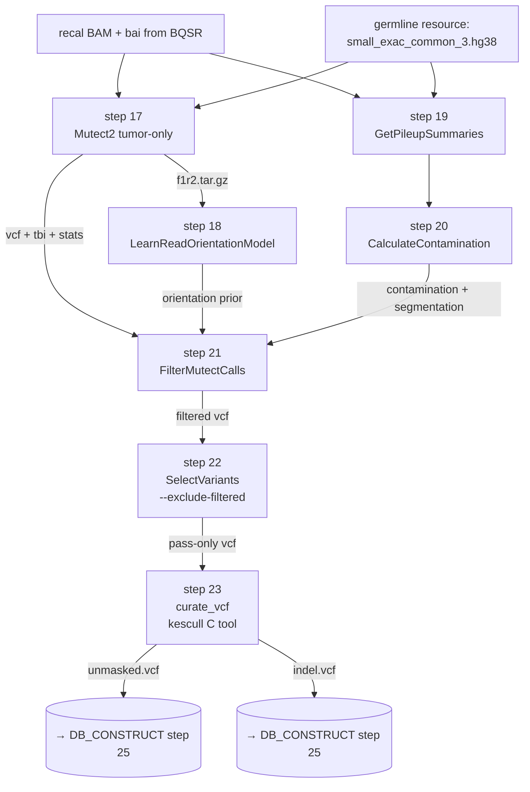

<Note>
Implements **steps 17–23** of the legacy bash pipeline (`output/run_allSteps.sh` lines 86–92). Takes the recalibrated BAM from [BQSR](/pipeline/bqsr) and produces two curated VCFs (unmasked + indel) that feed [DB_CONSTRUCT](/pipeline/db-construct) for the alt-reference branch. **Step 23 is the first deep-dive on a kescull C tool.**
</Note>

<Warning>
**This pipeline runs Mutect2 in tumor-only single-BAM mode.** It does **NOT** support **matched tumor-normal** variant calling — there is no `-I:normal` argument anywhere in the subworkflow, and the contamination correction in step 20 is computed without a matched-normal pileup.

If your sample is part of a **matched tumor-normal cohort** and you need somatic-vs-germline discrimination via a paired control BAM, you must run a different pipeline (e.g. [`nf-core/sarek`](https://nf-co.re/sarek)) for the variant calling step and feed the resulting somatic VCF into a custom downstream peptide construction. Cancer-genomics conventions inherited from TCGA, ICGC, GATK Best Practices, and `nf-core/sarek` use the words "tumor" and "normal" to mean *the two BAMs in a matched-pair Mutect2 call*; that is **not** what IPG does. The IPG flag controlling whether Mutect2's variant calls are *consumed* by the cryptic peptide database is named [`include_variant_peptides`](/api-reference/parameters/advanced) precisely to avoid this confusion.
</Warning>

## Purpose

This subworkflow runs the somatic-variant arm of the GATK4 best-practices RNA-seq variant-calling pipeline against a single recalibrated BAM at a time, producing a stream of "putative somatic variants" — variant calls that have passed (a) Mutect2's tumor-only haplotype caller, (b) the read-orientation prior built from the F1R2 tally, (c) tumor-only contamination correction against a gnomAD-style germline allele-frequency database (`small_exac_common_3.hg38.vcf.gz`), and (d) GATK's `FilterMutectCalls` joint filter. The variants are then split by the kescull `curate_vcf` C tool into two streams that map cleanly onto the two alt-reference branches downstream:

- **`<sample>_unmasked.vcf`** — substitutions and indels with deletions removed (so a downstream deletion does not "shadow" a substitution site that overlaps it)
- **`<sample>_indel.vcf`** — substitutions and indels with deletions kept

These two VCFs feed `FastaAlternateReferenceMaker` in [DB_CONSTRUCT step 25](/pipeline/db-construct) to build the unmasked- and indel-branch alt-reference FASTAs.

<Tip>
Whether the cryptic FASTA built downstream actually **uses** these variants depends on the [`include_variant_peptides`](/api-reference/parameters/advanced) flag. The default is `false` (matches the legacy IPG paper behaviour; the variant VCFs are produced but not consumed). When set to `true`, `DB_CONSTRUCT` runs all three branches (reference + unmasked + indel) and `squish` merges them — capturing SNV- and indel-derived peptides for downstream MS/MS database search. See [variant peptide mode](/background/variant-peptide-mode).
</Tip>

## Data flow



## Steps in detail

<Steps>

  <Step title="Step 17 — Mutect2 (tumor-only)">

    ### What it does

    Runs GATK4's Mutect2 somatic-variant caller in **tumor-only single-BAM mode** against the recalibrated BAM from BQSR. Emits a raw VCF of putative somatic variants, an `f1r2.tar.gz` tally of read-orientation observations (consumed by step 18), and a `stats` file consumed by step 21. Tumor-only mode means there is no matched-normal BAM in the input — see the warning at the top of this page.

    ### Tool and version

    - **GATK4** `4.5.0+`
    - **Container:** `community.wave.seqera.io/library/gatk4_gcnvkernel:edb12e4f0bf02cd3`
    - **Resource label:** `process_low` (2 CPU / 12 GB / 4 h on Monash)

    ### Command

    <CodeGroup>

    ```bash legacy bash (run_allSteps.sh L86)
    gatk Mutect2 \
      -R "$Cryptic_dir/GRCh38/GRCh38.primary_assembly.genome.fa" \
      -I "$OUTPUT_DIR/Variant_Calling/${SAMPLE_NAME}_score_corrected.bam" \
      -O "$OUTPUT_DIR/Variant_Calling/${SAMPLE_NAME}_mutect.vcf.gz" \
      --f1r2-tar-gz "$OUTPUT_DIR/Variant_Calling/${SAMPLE_NAME}_f1r2.tar.gz" \
      &> "$OUTPUT_DIR/Variant_Calling/${SAMPLE_NAME}_M.log"
    ```

    ```groovy nf-core wrapper
    // subworkflows/local/mutect_calling/main.nf, lines 46–58
    ch_mutect_input = ch_recal_bam_bai
        .map { meta, bam, bai -> [meta, bam, bai, []] }   // no intervals

    GATK4_MUTECT2(
        ch_mutect_input,
        ch_fasta,
        ch_fai,
        ch_dict,
        ch_germline_resource,        // small_exac_common_3.hg38.vcf.gz
        ch_germline_tbi,
        [],                           // panel_of_normals — empty
        []                            // pon_tbi — empty
    )

    // ext.args override from conf/modules.config lines 136–138:
    //   withName: '.*:MUTECT_CALLING:GATK4_MUTECT2' {
    //       ext.args = { "--f1r2-tar-gz ${meta.id}.f1r2.tar.gz" }
    //   }
    ```

    </CodeGroup>

    ### Parameters

    | Flag | Value | Default | Rationale |
    |---|---|---|---|
    | `-I` (tumor) | recalibrated BAM from BQSR | (required) | The BQSR-corrected BAM. **The only `-I` argument** — there is no `-I:normal`. |
    | `-R` | `$params.fasta` (+ `.fai` + `.dict`) | (required) | Reference bundle. |
    | `--germline-resource` | `$params.germline_resource` (`small_exac_common_3.hg38.vcf.gz`) | (none) | Allele-frequency database used by Mutect2 to filter out common germline variants. **Critical for tumor-only mode** — without it, Mutect2 calls every common SNP as a putative somatic variant. The legacy IPG protocol uses the Broad small-ExAC bundle. |
    | `--panel-of-normals` | empty `[]` | (none) | No panel of normals. The IPG protocol does not build one. Tumor-only contamination correction in step 20 partially compensates. |
    | **`--f1r2-tar-gz`** | `<sample>.f1r2.tar.gz` | (off — channel empty) | **The load-bearing override.** The upstream `gatk4/mutect2` module declares the `f1r2` channel as `optional: true`, so without `--f1r2-tar-gz`, the channel is empty and `LearnReadOrientationModel` (step 18) silently has no input → its output is empty → `FilterMutectCalls` (step 21) silently drops the orientation prior → the entire pipeline produces a slightly-wrong result with no error. **Documented in `conf/modules.config:132-138`.** This is one of the silent-failure modes the docs site exists to warn users about. |
    | `--intervals` | empty `[]` | whole genome | No interval restriction. |

    ### Inputs / Outputs

    - **Inputs:** `[meta, recal_bam, recal_bai, intervals=[]]`, reference bundle, germline resource + tbi, empty PoN
    - **Outputs:**
      - `GATK4_MUTECT2.out.vcf` → fed to `FilterMutectCalls` (step 21)
      - `GATK4_MUTECT2.out.tbi` → fed to step 21
      - `GATK4_MUTECT2.out.stats` → fed to step 21
      - `GATK4_MUTECT2.out.f1r2` → fed to `LearnReadOrientationModel` (step 18) — **only present because of the `--f1r2-tar-gz` override**

    ### Citations

    - **Benjamin, D. et al. "Calling Somatic SNVs and Indels with Mutect2."** *bioRxiv* 861054 (2019). DOI: [10.1101/861054](https://doi.org/10.1101/861054). — the canonical Mutect2 method paper.
    - **Cibulskis, K. et al. "Sensitive detection of somatic point mutations in impure and heterogeneous cancer samples."** *Nat Biotechnol* **31**, 213–219 (2013). DOI: [10.1038/nbt.2514](https://doi.org/10.1038/nbt.2514). PMID: 23396013. — the original MuTect (v1) paper.
    - **GATK Best Practices — Somatic short variant discovery (SNVs + Indels):** [gatk.broadinstitute.org/hc/en-us/articles/360035894731](https://gatk.broadinstitute.org/hc/en-us/articles/360035894731-Somatic-short-variant-discovery-SNVs-Indels-).
    - **GATK4 `Mutect2` documentation:** [gatk.broadinstitute.org/hc/en-us/articles/360037593851](https://gatk.broadinstitute.org/hc/en-us/articles/360037593851-Mutect2).

    ### Source

    - Legacy bash: [`output/run_allSteps.sh` line 86](https://github.com/sanjaysgk/ipg)
    - Subworkflow: [`mutect_calling/main.nf` lines 46–58](https://github.com/sanjaysgk/ipg/blob/dev/cryptic-port/subworkflows/local/mutect_calling/main.nf#L46-L58)
    - Module override: [`conf/modules.config` lines 132–138](https://github.com/sanjaysgk/ipg/blob/dev/cryptic-port/conf/modules.config#L132-L138)

  </Step>

  <Step title="Step 18 — LearnReadOrientationModel">

    ### What it does

    Builds a per-sample **read orientation artifact prior** from the F1R2 tally emitted by Mutect2 in step 17. Read-orientation artifacts are systematic errors caused by oxidation damage during library prep — a base C in the original DNA can read as a C on one strand and as a T on the reverse complement, producing a false-positive C→T variant. The orientation model captures the expected ratio of forward / reverse reads at each variant site so that `FilterMutectCalls` (step 21) can identify and filter out artifacts. Particularly important for FFPE tissue and any sample stored long-term — both common in cryptic peptide / cancer immunology cohorts.

    ### Tool and version

    - **GATK4** `4.5.0+`
    - **Container:** `community.wave.seqera.io/library/gatk4_gcnvkernel:edb12e4f0bf02cd3`
    - **Resource label:** `process_single`

    ### Command

    <CodeGroup>

    ```bash legacy bash (run_allSteps.sh L87)
    gatk LearnReadOrientationModel \
      -I "$OUTPUT_DIR/Variant_Calling/${SAMPLE_NAME}_f1r2.tar.gz" \
      -O "$OUTPUT_DIR/Variant_Calling/${SAMPLE_NAME}_read-orientation-model.tar.gz"
    ```

    ```groovy nf-core wrapper
    // subworkflows/local/mutect_calling/main.nf, line 64
    GATK4_LEARNREADORIENTATIONMODEL(GATK4_MUTECT2.out.f1r2)

    // No ext.args override — defaults are correct.
    ```

    </CodeGroup>

    ### Parameters

    | Flag | Value | Default | Rationale |
    |---|---|---|---|
    | `-I` | `<sample>.f1r2.tar.gz` from Mutect2 | (required) | Joined automatically. Only present because step 17 has `--f1r2-tar-gz` set. |
    | `-O` | `<sample>.artifactprior.tar.gz` | (required) | The orientation prior, fed to `FilterMutectCalls` (step 21) as `--ob-priors`. |

    ### Inputs / Outputs

    - **Inputs:** `GATK4_MUTECT2.out.f1r2`
    - **Outputs:** `GATK4_LEARNREADORIENTATIONMODEL.out.artifactprior` → fed to step 21

    ### Citations

    - **Benjamin, D. et al. 2019** (Mutect2 bioRxiv) — describes the read-orientation correction algorithm.
    - **GATK4 `LearnReadOrientationModel` documentation:** [gatk.broadinstitute.org/hc/en-us/articles/360037226651](https://gatk.broadinstitute.org/hc/en-us/articles/360037226651-LearnReadOrientationModel).

    ### Source

    - Legacy bash: [`output/run_allSteps.sh` line 87](https://github.com/sanjaysgk/ipg)
    - Subworkflow: [`mutect_calling/main.nf` line 64](https://github.com/sanjaysgk/ipg/blob/dev/cryptic-port/subworkflows/local/mutect_calling/main.nf#L64)

  </Step>

  <Step title="Step 19 — GetPileupSummaries">

    ### What it does

    Walks the recalibrated BAM at each site in the germline allele-frequency VCF (`small_exac_common_3.hg38.vcf.gz`) and counts how many reads support the reference allele vs the alt allele. This per-site allele-count table is the input to step 20's contamination correction — if a sample is contaminated by reads from another donor, the alt-allele frequencies at common SNPs will deviate systematically from the expected 0%, 50%, or 100% pattern.

    ### Tool and version

    - **GATK4** `4.5.0+`
    - **Container:** `community.wave.seqera.io/library/gatk4_gcnvkernel:edb12e4f0bf02cd3`
    - **Resource label:** `process_low`

    ### Command

    <CodeGroup>

    ```bash legacy bash (run_allSteps.sh L88)
    gatk GetPileupSummaries \
      -I "$OUTPUT_DIR/Variant_Calling/${SAMPLE_NAME}_score_corrected.bam" \
      -V "$Cryptic_dir/.../small_exac_common_3.hg38.vcf.gz" \
      -L "$Cryptic_dir/.../small_exac_common_3.hg38.vcf.gz" \
      -O "$OUTPUT_DIR/Variant_Calling/${SAMPLE_NAME}_getpileupsummaries.table" \
      &> "$OUTPUT_DIR/Variant_Calling/${SAMPLE_NAME}_GPS.log"
    ```

    ```groovy nf-core wrapper
    // subworkflows/local/mutect_calling/main.nf, lines 72–82
    ch_pileup_input = ch_recal_bam_bai
        .map { meta, bam, bai -> [meta, bam, bai, []] }

    GATK4_GETPILEUPSUMMARIES(
        ch_pileup_input,
        ch_fasta,
        ch_fai,
        ch_dict,
        ch_germline_resource,
        ch_germline_tbi
    )
    ```

    </CodeGroup>

    ### Parameters

    | Flag | Value | Default | Rationale |
    |---|---|---|---|
    | `-I` | recalibrated BAM | (required) | The same BAM that fed Mutect2 in step 17. |
    | `-V` | `--germline_resource` | (required) | The allele-frequency VCF — both the VCF AND `-L` (intervals) point at the same file, so pileup is restricted to the common-variant sites only. Following the legacy IPG bash exactly. |
    | `-L` | `--germline_resource` (same path) | (required) | Restricts pileup to the common-SNP sites — orders-of-magnitude faster than whole-genome pileup and produces enough sites for the contamination model to converge. |
    | `-O` | `<sample>.pileups.table` | (required) | Per-site allele count table fed to step 20. |

    ### Inputs / Outputs

    - **Inputs:** recalibrated BAM + bai, reference bundle, germline resource + tbi
    - **Outputs:** `GATK4_GETPILEUPSUMMARIES.out.table` → fed to `CalculateContamination` (step 20)

    ### Citations

    - **GATK4 `GetPileupSummaries` documentation:** [gatk.broadinstitute.org/hc/en-us/articles/360036711591](https://gatk.broadinstitute.org/hc/en-us/articles/360036711591-GetPileupSummaries).
    - **Cibulskis, K. et al. "ContEst: estimating cross-contamination of human samples in next-generation sequencing data."** *Bioinformatics* **27**, 2601–2602 (2011). DOI: [10.1093/bioinformatics/btr446](https://doi.org/10.1093/bioinformatics/btr446). — the original contamination estimation algorithm that GetPileupSummaries + CalculateContamination implement.

    ### Source

    - Legacy bash: [`output/run_allSteps.sh` line 88](https://github.com/sanjaysgk/ipg)
    - Subworkflow: [`mutect_calling/main.nf` lines 72–82](https://github.com/sanjaysgk/ipg/blob/dev/cryptic-port/subworkflows/local/mutect_calling/main.nf#L72-L82)

  </Step>

  <Step title="Step 20 — CalculateContamination (tumor-only)">

    ### What it does

    Estimates the fraction of reads in the BAM that originate from a contaminating sample, using the per-site allele counts from step 19. **Run in tumor-only mode** — no matched-normal pileup is provided — which means the algorithm uses a single-sample contamination model rather than the more accurate tumor-vs-normal differential model. Tumor-only contamination estimates are noisier but still meaningful at the typical 0–5% range expected for ATLANTIS-style RNA-seq from clean tissue.

    Also produces a **tumor segmentation table** when run with `--tumor-segmentation` (which the IPG port enables via `ext.args`). The segmentation table partitions the genome into regions of consistent allele frequency — used by `FilterMutectCalls` (step 21) to flag variants in regions of unexpected loss-of-heterozygosity.

    ### Tool and version

    - **GATK4** `4.5.0+`
    - **Container:** `community.wave.seqera.io/library/gatk4_gcnvkernel:edb12e4f0bf02cd3`
    - **Resource label:** `process_single`

    ### Command

    <CodeGroup>

    ```bash legacy bash (run_allSteps.sh L89)
    gatk CalculateContamination \
      -I "$OUTPUT_DIR/Variant_Calling/${SAMPLE_NAME}_getpileupsummaries.table" \
      --tumor-segmentation "$OUTPUT_DIR/Variant_Calling/${SAMPLE_NAME}_segments.table" \
      -O "$OUTPUT_DIR/Variant_Calling/${SAMPLE_NAME}_calculatecontamination.table" \
      &> "$OUTPUT_DIR/Variant_Calling/${SAMPLE_NAME}_CC.log"
    ```

    ```groovy nf-core wrapper
    // subworkflows/local/mutect_calling/main.nf, lines 87–90
    ch_contam_input = GATK4_GETPILEUPSUMMARIES.out.table
        .map { meta, pileup -> [meta, pileup, []] }   // no matched-normal pileup

    GATK4_CALCULATECONTAMINATION(ch_contam_input)

    // ext.args override from conf/modules.config lines 145–147:
    //   withName: '.*:MUTECT_CALLING:GATK4_CALCULATECONTAMINATION' {
    //       ext.args = { "--tumor-segmentation ${meta.id}.segmentation.table" }
    //   }
    ```

    </CodeGroup>

    ### Parameters

    | Flag | Value | Default | Rationale |
    |---|---|---|---|
    | `-I` | pileup table from step 19 | (required) | Joined automatically. |
    | matched-normal pileup | empty list `[]` | (none) | Tumor-only mode. |
    | **`--tumor-segmentation`** | `<sample>.segmentation.table` | (off — channel empty) | **The second load-bearing override in this subworkflow.** The upstream `gatk4/calculatecontamination` module declares the `segmentation` channel as `optional: true`, so without `--tumor-segmentation`, the channel is empty and the `.join()` upstream of `FilterMutectCalls` (step 21) has nothing to join — the entire `MUTECT_CALLING → DB_CONSTRUCT` chain stalls silently. **Documented in `conf/modules.config:140-147`.** |

    ### Inputs / Outputs

    - **Inputs:** `[meta, pileup_table, matched_normal_pileup=[]]`
    - **Outputs:**
      - `GATK4_CALCULATECONTAMINATION.out.contamination` → fed to step 21 + emitted as `MUTECT_CALLING.out.contamination` for QC
      - `GATK4_CALCULATECONTAMINATION.out.segmentation` → fed to step 21 (only present because of the `--tumor-segmentation` override)

    ### Citations

    - **GATK4 `CalculateContamination` documentation:** [gatk.broadinstitute.org/hc/en-us/articles/360036711611](https://gatk.broadinstitute.org/hc/en-us/articles/360036711611-CalculateContamination).
    - **Cibulskis et al. 2011** (ContEst) — the underlying algorithm.

    ### Source

    - Legacy bash: [`output/run_allSteps.sh` line 89](https://github.com/sanjaysgk/ipg)
    - Subworkflow: [`mutect_calling/main.nf` lines 87–90](https://github.com/sanjaysgk/ipg/blob/dev/cryptic-port/subworkflows/local/mutect_calling/main.nf#L87-L90)
    - Module override: [`conf/modules.config` lines 145–147](https://github.com/sanjaysgk/ipg/blob/dev/cryptic-port/conf/modules.config#L145-L147)

  </Step>

  <Step title="Step 21 — FilterMutectCalls">

    ### What it does

    Joins the raw Mutect2 VCF, the read-orientation prior from step 18, the contamination estimate from step 20, and the tumor segmentation table from step 20 — and uses all four signals to apply the **GATK4 joint somatic filter** to every variant call. Variants that fail any filter (read orientation artifact, contamination, low quality, clustered events, etc.) are tagged in the VCF `FILTER` column with their failure reason; passing variants get `PASS`. Step 22 then keeps only the `PASS`-tagged ones.

    ### Tool and version

    - **GATK4** `4.5.0+`
    - **Container:** `community.wave.seqera.io/library/gatk4_gcnvkernel:edb12e4f0bf02cd3`
    - **Resource label:** `process_low`

    ### Command

    <CodeGroup>

    ```bash legacy bash (run_allSteps.sh L90)
    gatk FilterMutectCalls \
      -V "$OUTPUT_DIR/Variant_Calling/${SAMPLE_NAME}_mutect.vcf.gz" \
      --tumor-segmentation "$OUTPUT_DIR/Variant_Calling/${SAMPLE_NAME}_segments.table" \
      --contamination-table "$OUTPUT_DIR/Variant_Calling/${SAMPLE_NAME}_calculatecontamination.table" \
      -ob-priors "$OUTPUT_DIR/Variant_Calling/${SAMPLE_NAME}_read-orientation-model.tar.gz" \
      -O "$OUTPUT_DIR/Variant_Calling/${SAMPLE_NAME}_mutect_COV_filtered.vcf" \
      -R "$Cryptic_dir/GRCh38/GRCh38.primary_assembly.genome.fa" \
      &> "$OUTPUT_DIR/Variant_Calling/${SAMPLE_NAME}_FMC.log"
    ```

    ```groovy nf-core wrapper
    // subworkflows/local/mutect_calling/main.nf, lines 98–111
    ch_filter_input = GATK4_MUTECT2.out.vcf
        .join(GATK4_MUTECT2.out.tbi)
        .join(GATK4_MUTECT2.out.stats)
        .join(GATK4_LEARNREADORIENTATIONMODEL.out.artifactprior)
        .join(GATK4_CALCULATECONTAMINATION.out.segmentation)
        .join(GATK4_CALCULATECONTAMINATION.out.contamination)
        .map { meta, vcf, tbi, stats, bias, seg, table -> [meta, vcf, tbi, stats, bias, seg, table, []] }

    GATK4_FILTERMUTECTCALLS(
        ch_filter_input,
        ch_fasta,
        ch_fai,
        ch_dict
    )

    // ext.prefix override from conf/modules.config lines 153–155:
    //   ext.prefix = { "${meta.id}.filtered" }
    ```

    </CodeGroup>

    ### Parameters

    | Flag | Value | Default | Rationale |
    |---|---|---|---|
    | `-V` | raw Mutect2 VCF | (required) | Joined channel. |
    | `--ob-priors` | orientation prior from step 18 | (off) | The orientation artifact filter is enabled because we have priors. |
    | `--contamination-table` | contamination from step 20 | (off) | Contamination filter enabled. |
    | `--tumor-segmentation` | segmentation from step 20 | (off) | LOH-aware filter enabled. |
    | `-ext.prefix` | `<sample>.filtered` | `<sample>` | **Distinct prefix is critical**: the upstream module's default prefix is `${meta.id}` which collides with the input file `${meta.id}.vcf.gz`. Nextflow excludes input files from the output match set, so the emit fails with `Missing output file(s) *.vcf.gz`. Documented in `conf/modules.config:149-155`. |

    ### Inputs / Outputs

    - **Inputs:** `[meta, vcf, tbi, stats, ob_priors, segmentation, contamination, intervals=[]]`, reference bundle
    - **Outputs:**
      - `GATK4_FILTERMUTECTCALLS.out.vcf` → fed to `SelectVariants` (step 22) + emitted as `MUTECT_CALLING.out.filtered_vcf` for inspection
      - `GATK4_FILTERMUTECTCALLS.out.tbi` → fed to step 22

    ### Citations

    - **GATK4 `FilterMutectCalls` documentation:** [gatk.broadinstitute.org/hc/en-us/articles/360036856831](https://gatk.broadinstitute.org/hc/en-us/articles/360036856831-FilterMutectCalls).
    - **Benjamin et al. 2019** — describes the joint filter algorithm.

    ### Source

    - Legacy bash: [`output/run_allSteps.sh` line 90](https://github.com/sanjaysgk/ipg)
    - Subworkflow: [`mutect_calling/main.nf` lines 98–111](https://github.com/sanjaysgk/ipg/blob/dev/cryptic-port/subworkflows/local/mutect_calling/main.nf#L98-L111)
    - Module override: [`conf/modules.config` lines 149–155](https://github.com/sanjaysgk/ipg/blob/dev/cryptic-port/conf/modules.config#L149-L155)

  </Step>

  <Step title="Step 22 — SelectVariants (PASS-only, sites-only)">

    ### What it does

    Filters the post-`FilterMutectCalls` VCF down to **PASS-only, sites-only** records. PASS-only drops everything that didn't survive the joint filter in step 21; sites-only strips per-sample genotype columns leaving just `CHROM POS ID REF ALT QUAL FILTER INFO`. The sites-only output is what `FastaAlternateReferenceMaker` consumes in [step 25](/pipeline/db-construct#step-25-fastaalternatereferencemaker) — the genotype columns aren't needed downstream and dropping them reduces VCF size by 2–3×.

    ### Tool and version

    - **GATK4** `4.5.0+`
    - **Container:** `community.wave.seqera.io/library/gatk4_gcnvkernel:edb12e4f0bf02cd3`
    - **Resource label:** `process_single`

    ### Command

    <CodeGroup>

    ```bash legacy bash (run_allSteps.sh L91)
    gatk SelectVariants \
      -V "$OUTPUT_DIR/Variant_Calling/${SAMPLE_NAME}_mutect_COV_filtered.vcf" \
      --exclude-filtered true \
      --sites-only-vcf-output true \
      -O "$OUTPUT_DIR/Variant_Calling/${SAMPLE_NAME}_mutect_COV_pass.vcf" \
      &> "$OUTPUT_DIR/Variant_Calling/${SAMPLE_NAME}_SV.log"
    ```

    ```groovy nf-core wrapper
    // subworkflows/local/mutect_calling/main.nf, lines 119–123
    ch_select_input = GATK4_FILTERMUTECTCALLS.out.vcf
        .join(GATK4_FILTERMUTECTCALLS.out.tbi)
        .map { meta, vcf, tbi -> [meta, vcf, tbi, []] }

    GATK4_SELECTVARIANTS(ch_select_input)

    // ext.args + ext.prefix override from conf/modules.config lines 159–162:
    //   withName: '.*:MUTECT_CALLING:GATK4_SELECTVARIANTS' {
    //       ext.args   = '--exclude-filtered true --sites-only-vcf-output true'
    //       ext.prefix = { "${meta.id}.pass" }
    //   }
    ```

    </CodeGroup>

    ### Parameters

    | Flag | Value | Default | Rationale |
    |---|---|---|---|
    | `--exclude-filtered` | `true` | `false` | Drop everything that wasn't tagged `PASS` by step 21. The legacy script uses this exactly. |
    | `--sites-only-vcf-output` | `true` | `false` | Strip per-sample genotype columns. Reduces VCF size; matches the legacy IPG protocol; downstream tools don't need genotypes. |
    | `ext.prefix` | `<sample>.pass` | `<sample>` | Same input/output filename collision fix as step 21. |

    ### Inputs / Outputs

    - **Inputs:** `[meta, filtered_vcf, filtered_tbi, intervals=[]]`
    - **Outputs:** `GATK4_SELECTVARIANTS.out.vcf` → fed to `curate_vcf` (step 23). This is the file the legacy script names `_mutect_COV_pass.vcf`.

    ### Citations

    - **GATK4 `SelectVariants` documentation:** [gatk.broadinstitute.org/hc/en-us/articles/360037226612](https://gatk.broadinstitute.org/hc/en-us/articles/360037226612-SelectVariants).

    ### Source

    - Legacy bash: [`output/run_allSteps.sh` line 91](https://github.com/sanjaysgk/ipg)
    - Subworkflow: [`mutect_calling/main.nf` lines 119–123](https://github.com/sanjaysgk/ipg/blob/dev/cryptic-port/subworkflows/local/mutect_calling/main.nf#L119-L123)
    - Module override: [`conf/modules.config` lines 159–162](https://github.com/sanjaysgk/ipg/blob/dev/cryptic-port/conf/modules.config#L159-L162)

  </Step>

  <Step title="Step 23 — curate_vcf (kescull C tool — first deep dive)">

    ### What it does

    `curate_vcf` is the **first kescull C tool** in the pipeline and the first local-module deep dive on this site. Authored by **Katherine E. Scull** for the original 2021 IPG paper. It reads the PASS-only sites-only VCF from step 22 and produces **two output VCFs**:

    - **`<sample>_indel.vcf`** — emitted by `curate_vcf <input.vcf>` (no `-d` flag). Includes substitutions and indels with deletions **kept**. The deletions remain in this VCF so `FastaAlternateReferenceMaker` can express deletion-derived novel C-terminal tracts in the indel-branch alt-reference.
    - **`<sample>_unmasked.vcf`** — emitted by `curate_vcf -d <input.vcf>`. Includes substitutions and indels with deletions **removed**. The deletions are stripped because in the unmasked-branch alt-reference, a downstream substitution site that overlaps a deletion would be silently shadowed by the deletion (the substitution would never be expressed in the alt-reference FASTA). Removing deletions prevents this.

    Both VCFs are then fed to [`FastaAlternateReferenceMaker` in DB_CONSTRUCT step 25](/pipeline/db-construct#step-25-fastaalternatereferencemaker).

    The C tool reads the VCF as plain text and **segfaults on empty inputs** (no variant records). The Nextflow wrapper guards against this by short-circuiting to empty output when there are zero non-header lines — common on tiny test data and on real samples that simply have no somatic variants in the analysed region. The wrapper also handles `.vcf.gz` decompression transparently because the C tool only reads plain text.

    ### Tool and version

    - **`curate_vcf`** — kescull C tool, source: [github.com/sanjaysgk/immunopeptidogenomics](https://github.com/sanjaysgk/immunopeptidogenomics) (forked from `kescull/immunopeptidogenomics`)
    - **Pinned commit:** `kescull/immunopeptidogenomics@fef8e68` (recorded in `versions.yml`)
    - **Container:** `ghcr.io/sanjaysgk/ipg-tools:0.1.0` — a custom container built from `containers/ipg-tools/Dockerfile` in the pipeline repo, compiling the C source with `gcc -O2`. **Never** to be rewritten in another language; the C lineage is preserved for citation continuity with Scull et al. 2021.
    - **Module type:** **local** (`modules/local/curate_vcf/`) — there is no nf-core module for kescull tools
    - **Resource label:** `process_single`

    ### Command

    <CodeGroup>

    ```bash legacy bash (run_allSteps.sh L92)
    "$IPG_programs/curate_vcf.o" \
      "$OUTPUT_DIR/Variant_Calling/${SAMPLE_NAME}_mutect_COV_pass.vcf" \
      -d \
      &> "$OUTPUT_DIR/Variant_Calling/${SAMPLE_NAME}_CV1.log"

    "$IPG_programs/curate_vcf.o" \
      "$OUTPUT_DIR/Variant_Calling/${SAMPLE_NAME}_mutect_COV_pass.vcf" \
      &> "$OUTPUT_DIR/Variant_Calling/${SAMPLE_NAME}_CV2.log"
    ```

    ```bash nf-core local module script (modules/local/curate_vcf/main.nf)
    # Decompress .vcf.gz transparently
    case "${vcf}" in
        *.vcf.gz)
            stem=$(basename ${vcf} .vcf.gz)
            gunzip -c ${vcf} > "${stem}.vcf"
            input_vcf="${stem}.vcf"
            ;;
        *.vcf)
            stem=$(basename ${vcf} .vcf)
            input_vcf="${vcf}"
            ;;
    esac

    # Empty-VCF guard — curate_vcf segfaults on zero variant records
    n_variants=$(grep -vc '^#' "${input_vcf}" || true)
    if [ "${n_variants}" -eq 0 ]; then
        cp "${input_vcf}" ${prefix}_indel.vcf
        cp "${input_vcf}" ${prefix}_unmasked.vcf
    else
        # Indel-preserving curation (no -d): deletions are KEPT
        curate_vcf "${input_vcf}"
        mv "${stem}_indel.vcf" ${prefix}_indel.vcf

        # Deletion-deprioritised curation (-d flag)
        curate_vcf -d "${input_vcf}"
        mv "${stem}_unmasked.vcf" ${prefix}_unmasked.vcf
    fi
    ```

    ```groovy subworkflow call
    // subworkflows/local/mutect_calling/main.nf, line 131
    CURATE_VCF(GATK4_SELECTVARIANTS.out.vcf)
    ```

    </CodeGroup>

    ### Parameters

    | Flag | Value | Default | Rationale |
    |---|---|---|---|
    | (positional) input VCF | `<sample>.pass.vcf.gz` from step 22 | (required) | The PASS-only sites-only VCF. Decompressed by the wrapper if `.vcf.gz`. |
    | `-d` | enabled in **one** of the two calls | not set | The `-d` flag means "deletion-deprioritised" — deletions are removed from the output. Without `-d`, deletions are kept. The pipeline runs the tool **twice** to produce both branches in a single process invocation. |
    | empty-VCF short-circuit | enabled | (would segfault) | The Nextflow wrapper guards against the C tool segfaulting on empty input by counting non-header lines and short-circuiting to empty output if zero. **Critical for small test datasets and for real samples with no somatic variants** in the analysed region. |
    | `.vcf.gz` decompression | transparent | (C tool only reads plain text) | The wrapper detects `.vcf.gz` and pipes through `gunzip` so the C tool sees plain text. The pipeline passes whatever `gatk4/selectvariants` emitted (`.vcf.gz` by default). |

    ### Inputs / Outputs

    - **Inputs:** `GATK4_SELECTVARIANTS.out.vcf` (`[meta, vcf]`)
    - **Outputs:**
      - `CURATE_VCF.out.unmasked` → re-emitted as `MUTECT_CALLING.out.unmasked_vcf` (consumed by `DB_CONSTRUCT` step 25)
      - `CURATE_VCF.out.indel` → re-emitted as `MUTECT_CALLING.out.indel_vcf` (consumed by `DB_CONSTRUCT` step 25)
      - `CURATE_VCF.out.log` — per-sample curation log (audit only)
      - `CURATE_VCF.out.versions` — `versions.yml` with the kescull commit hash

    ### Citations

    - **Scull, K. E., Pandey, K., Ramarathinam, S. H. & Purcell, A. W.** "Immunopeptidogenomics: Harnessing RNA-Seq to Illuminate the Dark Immunopeptidome." *Mol Cell Proteomics* **20**, 100143 (2021). DOI: [10.1016/j.mcpro.2021.100143](https://doi.org/10.1016/j.mcpro.2021.100143). **The founding paper** — `curate_vcf` was first described here as part of the IPG cryptic peptide protocol.
    - **Source repository:** [github.com/sanjaysgk/immunopeptidogenomics](https://github.com/sanjaysgk/immunopeptidogenomics) (forked from `kescull/immunopeptidogenomics`).
    - **`curate_vcf.c`** — the C source. The two output filename suffixes (`_indel.vcf` and `_unmasked.vcf`) come from `curate_vcf.c:77-79`.

    ### Source

    - Legacy bash: [`output/run_allSteps.sh` line 92](https://github.com/sanjaysgk/ipg)
    - Subworkflow: [`mutect_calling/main.nf` line 131](https://github.com/sanjaysgk/ipg/blob/dev/cryptic-port/subworkflows/local/mutect_calling/main.nf#L131)
    - Local module: [`modules/local/curate_vcf/main.nf`](https://github.com/sanjaysgk/ipg/blob/dev/cryptic-port/modules/local/curate_vcf/main.nf)
    - C source (upstream): [github.com/sanjaysgk/immunopeptidogenomics](https://github.com/sanjaysgk/immunopeptidogenomics)
    - Container Dockerfile: [`containers/ipg-tools/Dockerfile`](https://github.com/sanjaysgk/ipg/blob/dev/cryptic-port/containers/ipg-tools/Dockerfile)

  </Step>

</Steps>

## Inputs

<ParamField path="ch_recal_bam_bai" type="channel: [meta, bam, bai]" required>
  Recalibrated BAM and its index from `BQSR.out.recal_bam_bai`.
</ParamField>

<ParamField path="ch_fasta" type="channel: [meta, path]" required>
  Reference FASTA.
</ParamField>

<ParamField path="ch_fai" type="channel: [meta, path]" required>
  samtools FAI index.
</ParamField>

<ParamField path="ch_dict" type="channel: [meta, path]" required>
  GATK4 sequence dictionary.
</ParamField>

<ParamField path="ch_germline_resource" type="channel: path" required>
  gnomAD-style germline allele-frequency VCF (`small_exac_common_3.hg38.vcf.gz` in the legacy protocol). See [Germline parameters](/api-reference/parameters/germline-contamination).
</ParamField>

<ParamField path="ch_germline_tbi" type="channel: path" required>
  Tabix index for the germline resource.
</ParamField>

## Outputs

<ResponseField name="unmasked_vcf" type="channel: [meta, vcf]">
  Curated VCF from `curate_vcf -d`. **Consumed by `DB_CONSTRUCT` step 25** to build the unmasked-branch alt-reference FASTA.
</ResponseField>

<ResponseField name="indel_vcf" type="channel: [meta, vcf]">
  Curated VCF from `curate_vcf` (no `-d`). **Consumed by `DB_CONSTRUCT` step 25** to build the indel-branch alt-reference FASTA.
</ResponseField>

<ResponseField name="filtered_vcf" type="channel: [meta, vcf]">
  Pre-curation VCF from `FilterMutectCalls` (step 21). Audit only.
</ResponseField>

<ResponseField name="contamination" type="channel: [meta, table]">
  Contamination estimate from step 20. QC.
</ResponseField>

## Tools

| Tool | Version | Purpose | Citation |
|---|---|---|---|
| GATK4 Mutect2 | 4.5.0+ | Tumor-only somatic variant calling | [Benjamin et al. 2019](https://doi.org/10.1101/861054) · [Cibulskis et al. 2013](https://doi.org/10.1038/nbt.2514) |
| GATK4 LearnReadOrientationModel | 4.5.0+ | Read-orientation artifact prior | [Benjamin et al. 2019](https://doi.org/10.1101/861054) |
| GATK4 GetPileupSummaries | 4.5.0+ | Per-site allele counts at common SNPs | [Cibulskis et al. 2011](https://doi.org/10.1093/bioinformatics/btr446) |
| GATK4 CalculateContamination | 4.5.0+ | Tumor-only contamination + segmentation | [GATK BP](https://gatk.broadinstitute.org/hc/en-us/articles/360035894731) |
| GATK4 FilterMutectCalls | 4.5.0+ | Joint somatic filter | [Benjamin et al. 2019](https://doi.org/10.1101/861054) |
| GATK4 SelectVariants | 4.5.0+ | PASS-only sites-only filtering | [GATK4 docs](https://gatk.broadinstitute.org/hc/en-us/articles/360037226612) |
| **curate_vcf** (kescull C, local) | `kescull/immunopeptidogenomics@fef8e68` | Split into unmasked + indel VCFs for alt-reference construction | [Scull et al. 2021](https://doi.org/10.1016/j.mcpro.2021.100143) |

## See also

<Columns cols={2}>
  <Card title="← Previous: BQSR" icon="arrow-left" href="/pipeline/bqsr">
    Steps 13–16: Base Quality Score Recalibration.
  </Card>
  <Card title="Next: DB_CONSTRUCT →" icon="arrow-right" href="/pipeline/db-construct">
    Steps 24–31: build the cryptic peptide FASTA database.
  </Card>
</Columns>
