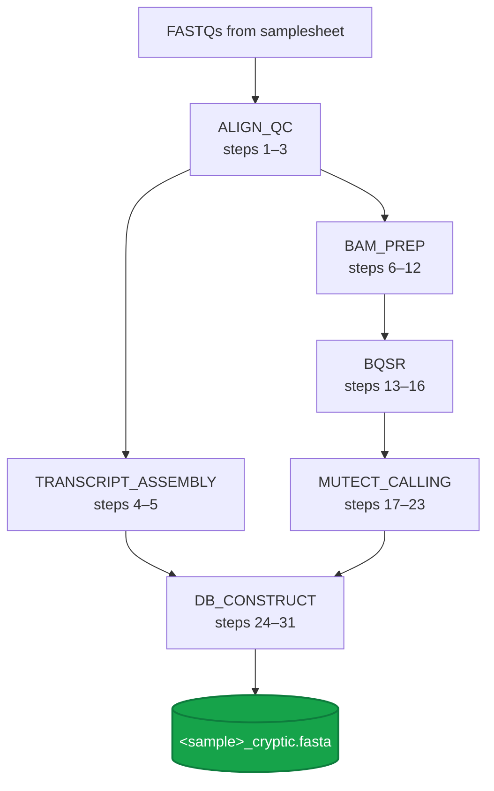

<Note>
This page is the **canonical map** of `sanjaysgk/ipg`. Every step in the legacy bash pipeline (`run_allSteps.sh`) is accounted for, every kescull C tool is credited, and every output channel is named. Subworkflow detail pages are linked from each row.
</Note>

## The 6-subworkflow tube map

## Step-by-step map

<Tip>
**On the "32 steps" question:** the legacy bash array in `run_allSteps.sh` has **32 entries** because step 31 (`Squish`) is duplicated at lines 100 and 101 — almost certainly a copy-paste leftover. There are **31 logically distinct steps**. This page documents the 31 distinct steps; both bash array entries map to the same `squish` invocation in the nf-core port.
</Tip>

### ALIGN_QC — steps 1–3

| # | Step | Tool | Module type |
|---|---|---|---|
| 1 | Alignment | STAR 2.7.9a (`--twopassMode Basic`) | nf-core (`star/align`) |
| 2 | Infer experiment | RSeQC `infer_experiment.py` | nf-core (`rseqc/inferexperiment`) |
| 3 | Sort SAM (coordinate) | `samtools sort` | nf-core (`samtools/sort`) |

→ See [pipeline/align-qc](/pipeline/align-qc) and [channels: align-qc](/api-reference/channels/align-qc).

### TRANSCRIPT_ASSEMBLY — steps 4–5

| # | Step | Tool | Module type |
|---|---|---|---|
| 4 | StringTie assembly | StringTie 2.1.5 (`-L COV`) | nf-core (`stringtie/stringtie`) |
| 5 | gffcompare reconciliation | gffcompare | nf-core (`gffcompare`) |

→ See [pipeline/transcript-assembly](/pipeline/transcript-assembly).

### BAM_PREP — steps 6–12

| # | Step | Tool | Module type |
|---|---|---|---|
| 6 | STAR mapping (2nd pass) | STAR 2.7.9a | nf-core |
| 7 | Sort SAM by query name | `samtools sort -n` | nf-core |
| 8 | Fastq → uBAM | `gatk FastqToSam` | nf-core (`gatk4/fastqtosam`) |
| 9 | MergeBamAlignment | `gatk MergeBamAlignment` | nf-core (`gatk4/mergebamalignment`) |
| 10 | MarkDuplicates | `gatk MarkDuplicates` | nf-core (`gatk4/markduplicates`) |
| 11 | SplitNCigarReads | `gatk SplitNCigarReads` | nf-core (`gatk4/splitncigarreads`) |
| 12 | ValidateSamFile | `gatk ValidateSamFile` | nf-core (`gatk4/validatesamfile`) |

→ See [pipeline/bam-prep](/pipeline/bam-prep).

### BQSR — steps 13–16

| # | Step | Tool | Module type |
|---|---|---|---|
| 13 | BaseRecalibrator (1st pass) | `gatk BaseRecalibrator` | nf-core (`gatk4/baserecalibrator`) |
| 14 | ApplyBQSR | `gatk ApplyBQSR` | nf-core (`gatk4/applybqsr`) |
| 15 | BaseRecalibrator (2nd pass) | `gatk BaseRecalibrator` (aliased) | nf-core |
| 16 | AnalyzeCovariates | `gatk AnalyzeCovariates` | nf-core (`gatk4/analyzecovariates`) |

→ See [pipeline/bqsr](/pipeline/bqsr) and [Known sites parameters](/api-reference/parameters/known-sites).

### MUTECT_CALLING — steps 17–23

| # | Step | Tool | Module type |
|---|---|---|---|
| 17 | Mutect2 | `gatk Mutect2` | nf-core (`gatk4/mutect2`) |
| 18 | LearnReadOrientationModel | `gatk LearnReadOrientationModel` | nf-core |
| 19 | GetPileupSummaries | `gatk GetPileupSummaries` | nf-core |
| 20 | CalculateContamination | `gatk CalculateContamination` | nf-core |
| 21 | FilterMutectCalls | `gatk FilterMutectCalls` | nf-core |
| 22 | SelectVariants | `gatk SelectVariants` | nf-core |
| 23 | **Curate VCF** | **`curate_vcf`** (kescull C) | **local** |

→ See [pipeline/mutect-calling](/pipeline/mutect-calling).

### DB_CONSTRUCT — steps 24–31

| # | Step | Tool | Module type |
|---|---|---|---|
| 24 | IndexFeatureFile | `gatk IndexFeatureFile` | nf-core |
| 25 | FastaAlternateReferenceMaker | `gatk FastaAlternateReferenceMaker` | nf-core |
| 26 | **Revert headers** | **`revert_headers`** (kescull C) | **local** |
| 27 | **Sort assembly GTF** | **`gff3sort.pl`** (third-party Perl) | **local** |
| 28 | **Liftover GTF** | **`alt_liftover`** (kescull C) | **local** |
| 29 | gffread | `gffread` | nf-core |
| 30 | **Triple translate** | **`triple_translate`** (kescull C) | **local** |
| 31 | **Squish** | **`squish`** (kescull C) → **`<sample>_cryptic.fasta`** ★ | **local** |

→ See [pipeline/db-construct](/pipeline/db-construct).

## kescull tools and provenance

Five of the six local modules wrap C tools authored by **Katherine E. Scull** for the original publication. They are preserved as plain C — never to be rewritten in another language — to maintain citation lineage with the founding paper.

| Tool | Step | Original repo |
|---|---|---|
| `curate_vcf` | 23 | [sanjaysgk/immunopeptidogenomics](https://github.com/sanjaysgk/immunopeptidogenomics) |
| `revert_headers` | 26 | same |
| `alt_liftover` | 28 | same |
| `triple_translate` | 30 | same |
| `squish` | 31 | same |

## What is NOT in this pipeline (yet)

The Scull et al. 2021 paper covers **more** than database construction. The downstream half — MS database search, peptide classification, and biological origin assignment — relies on tools that have **not yet been ported**:

| Tool | Purpose | Future home |
|---|---|---|
| `filter_FPKM.c` | Filter StringTie transcripts by FPKM | `ipg-origins` |
| `origins.c` | Classify peptide origin (intron / UTR / frameshift / novel ORF) | `ipg-origins` |
| `msDot.c` | MS spectrum dot products | `ipg-origins` |
| `db_compare.R` / `db_compare_v2.R` | Compare PEAKS results across databases | `ipg-origins` |

These will land in a planned **`sanjaysgk/ipg-origins` sister pipeline** — see [Related work and roadmap](/background/related-work).

## Reference data required

The pipeline cannot start without these reference files (validated at workflow entry):

| File | Param | Source in the legacy pipeline |
|---|---|---|
| GRCh38 primary FASTA | `--fasta` | `GRCh38/GRCh38.primary_assembly.genome.fa` |
| FASTA index | `--fasta_fai` | derived |
| Sequence dictionary | `--fasta_dict` | derived |
| STAR index | `--star_index` | `human_genome_index_GRCh38/` |
| GENCODE v44 GTF | `--gtf` | `GRCh38/gencode.v44.primary_assembly.annotation.gtf` |
| RSeQC strand BED | `--rseqc_bed` | `variant_calling_resources/gencode_assembly.bed` |
| dbSNP138 | `--dbsnp` | `variant_calling_resources/...dbsnp138.vcf` |
| Broad known indels | `--known_indels` | `variant_calling_resources/...known_indels.vcf.gz` |
| Mills + 1000G | `--mills` | `variant_calling_resources/...Mills_and_1000G_gold_standard...vcf.gz` |
| Small ExAC (germline) | `--germline_resource` | `variant_calling_resources/small_exac_common_3.hg38.vcf.gz` |

→ Full parameter docs: [Reference genome parameters](/api-reference/parameters/reference-genome) · [Known sites parameters](/api-reference/parameters/known-sites) · [Germline parameters](/api-reference/parameters/germline-contamination).

## Where to next

<Columns cols={2}>
  <Card title="ALIGN_QC subworkflow" icon="arrow-right" href="/pipeline/align-qc">
    Start with the first three steps: STAR, RSeQC, sort.
  </Card>
  <Card title="Reference overview" icon="square-terminal" href="/api-reference/overview">
    Look up every parameter, channel, profile, and output.
  </Card>
</Columns>
