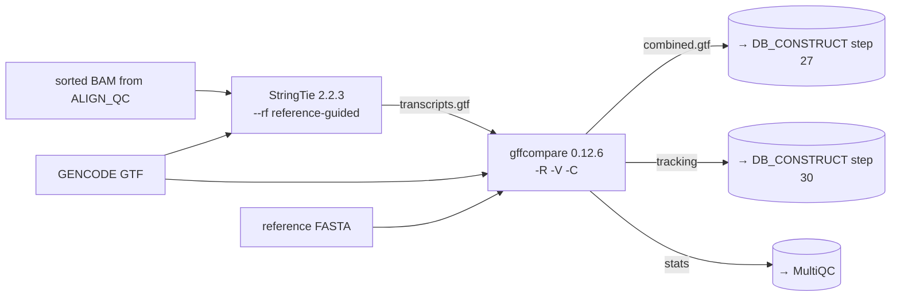

<Note>
Implements **steps 4–5** of the legacy bash pipeline (`output/run_allSteps.sh` lines 73–74). Consumes the coordinate-sorted BAM from [ALIGN_QC](/pipeline/align-qc) and produces the assembled-transcript GTF and the gffcompare tracking file that downstream `DB_CONSTRUCT` (steps 24–31) depends on.
</Note>

## Purpose

This subworkflow is where the **novel transcripts** that drive cryptic peptide discovery come from. StringTie does reference-guided assembly — it uses GENCODE as a scaffold but is free to call **new transcripts, new isoforms, intron retention events, and ORFs in untranslated regions or intergenic space**. gffcompare then reconciles each assembled transcript against the GENCODE reference and emits class codes (`=`, `j`, `i`, `u`, `o`, etc.) so downstream tools can distinguish "matches an annotated transcript exactly" from "novel intronic ORF".

The two outputs that drive everything downstream are:

- **`prefix.combined.gtf`** — the consensus assembly with `TCONS_NNNNNN` IDs, consumed by `DB_CONSTRUCT` step 27 (`gff3sort`) and ultimately by `triple_translate` for the reference branch.
- **`prefix.tracking`** — the per-transcript class code table, consumed by `triple_translate -c` (step 30) so each translated peptide knows its class code (novel / known / antisense / intronic / intergenic).

## Data flow



## Steps in detail

<Steps>

  <Step title="Step 4 — StringTie reference-guided transcript assembly">

    ### What it does

    Assembles a per-sample transcriptome from the coordinate-sorted alignment, using GENCODE as a guide annotation. Strand-aware (`--rf` for the standard Illumina reverse-stranded library protocol used in the ATLANTIS dataset). The output is one GTF per sample listing every assembled transcript — both ones that match GENCODE annotations and novel transcripts that StringTie discovered from coverage patterns. Also emits a per-gene abundance table.

    ### Tool and version

    - **StringTie** `2.2.3` (pinned by container, upgraded from `2.1.5` in the legacy bash)
    - **Container:** `biocontainers/stringtie:2.2.3--h43eeafb_0` (Docker) / `depot.galaxyproject.org/singularity/stringtie:2.2.3--h43eeafb_0` (Singularity)
    - **Resource label:** `process_medium` (6 CPU / 36 GB / 8 h ceiling on Monash)

    ### Command

    <CodeGroup>

    ```bash legacy bash (run_allSteps.sh L73)
    module load stringtie/2.1.5
    stringtie \
      -p 12 \
      --rf \
      -G "$Cryptic_dir/GRCh38/gencode.v44.primary_assembly.annotation.gtf" \
      -L COV \
      -o "$OUTPUT_DIR/Transcripts.gtf" \
      "$OUTPUT_DIR/Aligned_sortedcoord.out.sam"
    ```

    ```groovy nf-core wrapper
    // subworkflows/local/transcript_assembly/main.nf, lines 31–34
    STRINGTIE_STRINGTIE(
        ch_sorted_bam,                              // [meta, bam]
        ch_reference_gtf.map { _meta, gtf -> gtf }  // bare path — module signature wants it
    )

    // No ext.args override in conf/modules.config — defaults are correct
    // for the IPG use case. The module derives strandedness from
    // meta.strandedness (set per-sample by the samplesheet) and adds
    // --fr or --rf accordingly. With -G set, the module also passes
    // -A (gene abundance) and -C (coverage GTF) automatically.
    ```

    </CodeGroup>

    ### Parameters

    | Flag | Value | StringTie default | Rationale |
    |---|---|---|---|
    | `-G` | `$params.gtf` (GENCODE v44) | (none — assembly without a reference) | Use GENCODE as a guide so the assembly attempts to match annotated transcripts where possible and only emits novel transcripts where coverage actually supports them. Without `-G`, StringTie does pure de-novo assembly with much higher false-positive rates and breaks downstream tools that expect annotated-transcript IDs. |
    | `--rf` (strandedness) | derived from `meta.strandedness` | unstranded | Set automatically by the nf-core module from the samplesheet's `strandedness` column (`reverse → --rf`, `forward → --fr`, `unstranded → omitted`). The ATLANTIS dataset uses standard Illumina TruSeq Stranded mRNA libraries which are reverse-stranded; the test samplesheet hard-codes `reverse`. **Auto-detection from RSeQC `infer_experiment.py` output is a Phase 2 enhancement** — currently the samplesheet value is trusted. |
    | `-A` | `<sample>.gene.abundance.txt` | (off) | Per-gene abundance table for QC. Not consumed by downstream subworkflows but useful for sanity-checking expression levels in MultiQC. |
    | `-C` | `<sample>.coverage.gtf` | (off) | Coverage GTF for QC. Auto-emitted by the nf-core module when `-G` is set. |
    | `-p` | 6 (Monash `process_medium`) / 12 (legacy) | 1 | Parallelisation. Read from `$task.cpus` set by the resource label. |
    | `-L COV` | **NOT used in the nf-core port** | — | The legacy bash used `-L COV` to enable long-read mode and produce `COV.NNN` transcript IDs. The nf-core port intentionally **omits** this — long-read mode (`-L`) is for PacBio / Nanopore reads, not Illumina short reads, and the IPG ATLANTIS data is short-read RNA-seq. The legacy `-L COV` was a benign misuse: StringTie still ran in short-read mode but emitted COV-prefixed IDs, which then required custom downstream handling. The nf-core port uses standard `STRG.NNN` / `MSTRG.NNN` IDs and downstream tools (`gffcompare`, `triple_translate`) handle them natively. **This is a deliberate behaviour change from the legacy script.** |

    <Tip>
    The samplesheet `strandedness` column is consumed here even though [step 2 RSeQC](/pipeline/align-qc#step-2-rseqc) also infers strandedness from the BAM. Currently the two are independent — RSeQC's output is informational only and StringTie trusts the samplesheet value. Wiring RSeQC's inference back into `meta.strandedness` automatically (so users don't have to fill in the column manually) is tracked as a Phase 2 enhancement in `../ipg/.claude/STATUS.md`.
    </Tip>

    ### Inputs / Outputs

    - **Inputs:** `ch_sorted_bam` (`[meta, bam]`) from `ALIGN_QC.out.sorted_bam`, `ch_reference_gtf` (path to GENCODE GTF, mapped through `.map { _meta, gtf -> gtf }` because the StringTie module wants a bare path not a tuple)
    - **Outputs:**
      - `STRINGTIE_STRINGTIE.out.transcript_gtf` → re-emitted as `TRANSCRIPT_ASSEMBLY.out.assembly_gtf` (consumed by `gffcompare` in step 5 AND directly by `gff3sort` in `DB_CONSTRUCT` step 27)
      - `STRINGTIE_STRINGTIE.out.abundance` → MultiQC
      - `STRINGTIE_STRINGTIE.out.coverage_gtf` → MultiQC

    ### Citations

    - **Pertea, M. et al. "StringTie enables improved reconstruction of a transcriptome from RNA-seq reads."** *Nature Biotechnology* **33**, 290–295 (2015). DOI: [10.1038/nbt.3122](https://doi.org/10.1038/nbt.3122). PMID: 25690850.
    - **Kovaka, S. et al. "Transcriptome assembly from long-read RNA-seq alignments with StringTie2."** *Genome Biology* **20**, 278 (2019). DOI: [10.1186/s13059-019-1910-1](https://doi.org/10.1186/s13059-019-1910-1). The current container ships StringTie2 (`2.2.3`) — this paper covers the v2 algorithm.
    - **Scull, K. E. et al. 2021** — uses `stringtie --rf -L COV` against GENCODE in the legacy IPG protocol. DOI: [10.1016/j.mcpro.2021.100143](https://doi.org/10.1016/j.mcpro.2021.100143).
    - **nf-core/modules `stringtie/stringtie`** — upstream module. [github.com/nf-core/modules/tree/master/modules/nf-core/stringtie/stringtie](https://github.com/nf-core/modules/tree/master/modules/nf-core/stringtie/stringtie).

    ### Source

    - Legacy bash: [`output/run_allSteps.sh` line 73](https://github.com/sanjaysgk/ipg) (`Step 04: StringTie`)
    - Subworkflow: [`subworkflows/local/transcript_assembly/main.nf` lines 31–34](https://github.com/sanjaysgk/ipg/blob/dev/cryptic-port/subworkflows/local/transcript_assembly/main.nf#L31-L34)
    - nf-core module: [`modules/nf-core/stringtie/stringtie/main.nf`](https://github.com/sanjaysgk/ipg/blob/dev/cryptic-port/modules/nf-core/stringtie/stringtie/main.nf)

  </Step>

  <Step title="Step 5 — gffcompare reconciliation">

    ### What it does

    Compares the per-sample StringTie assembly against the GENCODE reference annotation and emits a **consensus combined GTF** with stable `TCONS_NNNNNN` IDs plus a **tracking file** mapping every assembled transcript to a class code (`=` exact match, `j` novel multi-exon junction, `i` intronic, `u` unknown / intergenic, `o` generic exon overlap, etc.). The combined GTF and tracking file are the **two critical inputs** to the downstream peptide construction in `DB_CONSTRUCT` — without them, `triple_translate` can't tag peptides with their genomic origin and `gff3sort → alt_liftover` has no input.

    ### Tool and version

    - **gffcompare** `0.12.6` (pinned by container)
    - **Container:** `biocontainers/gffcompare:0.12.6--h9f5acd7_0` (Docker) / `depot.galaxyproject.org/singularity/gffcompare:0.12.6--h9f5acd7_0` (Singularity)
    - **Resource label:** `process_single` (1 CPU / 6 GB / 4 h on Monash — gffcompare is single-threaded and small)

    ### Command

    <CodeGroup>

    ```bash legacy bash (run_allSteps.sh L74)
    module load gffcompare
    gffcompare \
      -r "$Cryptic_dir/GRCh38/gencode.v44.primary_assembly.annotation.gtf" \
      -o prefix \
      -R -V -C \
      "$OUTPUT_DIR/Transcripts.gtf" \
      &> "$OUTPUT_DIR/gffcompare.log"
    ```

    ```groovy nf-core wrapper
    // subworkflows/local/transcript_assembly/main.nf, lines 39–43
    GFFCOMPARE(
        STRINGTIE_STRINGTIE.out.transcript_gtf,   // [meta, gtf]
        ch_fasta_fai,                              // [meta, fasta, fai]
        ch_reference_gtf                           // [meta, gtf]
    )

    // ext.args override from conf/modules.config lines 62–64:
    //   ext.args = '-R -V -C'
    //
    // The -C flag is LOAD-BEARING — it tells gffcompare to write the
    // <prefix>.combined.gtf with TCONS_NNNN IDs and class codes. The
    // nf-core gffcompare module declares combined_gtf as `optional: true`,
    // so without -C the channel is empty and DB_CONSTRUCT (which now
    // consumes combined_gtf) sees empty input and the entire downstream
    // chain stalls silently. Documented in conf/modules.config:55-61.
    ```

    </CodeGroup>

    ### Parameters

    | Flag | Value | gffcompare default | Rationale |
    |---|---|---|---|
    | `-r` | `$params.gtf` (GENCODE v44) | (none) | Reference annotation. gffcompare classifies each assembled transcript by comparing against this. Must match the GTF version used for `-G` in step 4, otherwise gene/transcript IDs won't match across `assembly_gtf` and the reference. |
    | `-s` | `$params.fasta` (forwarded automatically by the nf-core module) | (none) | Reference FASTA, used by gffcompare to refine class-code assignment for cases where the BAM coordinates alone are ambiguous. Auto-injected by the module when `ch_fasta_fai` is non-empty. |
    | `-R` | enabled | off | Restrict the reference set to transcripts that overlap the input — speeds up classification when the input has fewer transcripts than the reference. From the legacy script. |
    | `-V` | enabled | off | Verbose output — gffcompare prints the per-transcript classification table to stdout. Captured by the nf-core module's log channel. From the legacy script. |
    | **`-C`** | **enabled** | **off** | **The load-bearing flag.** Without `-C`, gffcompare does NOT emit `<prefix>.combined.gtf`. The IPG `DB_CONSTRUCT` subworkflow consumes `combined.gtf` for the `gff3sort → alt_liftover → gffread → triple_translate → squish` chain. If `-C` is omitted, the combined GTF channel is empty, downstream subworkflows see no input, and the pipeline silently produces no cryptic FASTA. **This was a Day-2 debugging finding** — see the comment in `conf/modules.config:55-61`. |
    | `-o` | `$prefix` (i.e. `<sample>`) | `gffcmp` | Output prefix so per-sample files don't collide. |

    <Warning>
    Do **not** drop `-C` from the gffcompare invocation. It looks like a verbose output flag but it's actually the trigger for the combined GTF emission, and the downstream subworkflows depend on it. Removing it produces a silently-broken pipeline that successfully runs all 31 steps but emits an empty cryptic FASTA. This trap caught the developer once already.
    </Warning>

    ### Inputs / Outputs

    - **Inputs:** `STRINGTIE_STRINGTIE.out.transcript_gtf` (assembled GTF), `ch_fasta_fai` (`[meta, fasta, fai]`), `ch_reference_gtf` (`[meta, gtf]`)
    - **Outputs:**
      - `GFFCOMPARE.out.combined_gtf` → re-emitted as `TRANSCRIPT_ASSEMBLY.out.combined_gtf` (consumed by `DB_CONSTRUCT` step 27 `gff3sort`)
      - `GFFCOMPARE.out.tracking` → re-emitted as `TRANSCRIPT_ASSEMBLY.out.tracking` (consumed by `DB_CONSTRUCT` step 30 `triple_translate -c`)
      - `GFFCOMPARE.out.stats` → MultiQC for the assembly QC panel
      - `loci`, `tmap`, `refmap`, `annotated_gtf` — auto-published, not directly consumed downstream

    ### Citations

    - **Pertea, G. & Pertea, M. "GFF Utilities: GffRead and GffCompare."** *F1000Research* **9**, 304 (2020). DOI: [10.12688/f1000research.23297.2](https://doi.org/10.12688/f1000research.23297.2). PMID: 32489650.
    - **gffcompare class code reference** — explains the `=`/`j`/`i`/`u`/`o` codes that downstream `triple_translate -c` uses to classify peptides. [ccb.jhu.edu/software/stringtie/gffcompare.shtml](https://ccb.jhu.edu/software/stringtie/gffcompare.shtml).
    - **Scull, K. E. et al. 2021** — uses gffcompare with `-R -V -C` against GENCODE in the legacy IPG protocol. DOI: [10.1016/j.mcpro.2021.100143](https://doi.org/10.1016/j.mcpro.2021.100143).
    - **nf-core/modules `gffcompare`** — upstream module. [github.com/nf-core/modules/tree/master/modules/nf-core/gffcompare](https://github.com/nf-core/modules/tree/master/modules/nf-core/gffcompare).

    ### Source

    - Legacy bash: [`output/run_allSteps.sh` line 74](https://github.com/sanjaysgk/ipg) (`Step 05: GFFCompare`)
    - Subworkflow: [`subworkflows/local/transcript_assembly/main.nf` lines 39–43](https://github.com/sanjaysgk/ipg/blob/dev/cryptic-port/subworkflows/local/transcript_assembly/main.nf#L39-L43)
    - Module override: [`conf/modules.config` lines 53–64](https://github.com/sanjaysgk/ipg/blob/dev/cryptic-port/conf/modules.config#L53-L64) (`ext.args = '-R -V -C'` with the load-bearing comment)
    - nf-core module: [`modules/nf-core/gffcompare/main.nf`](https://github.com/sanjaysgk/ipg/blob/dev/cryptic-port/modules/nf-core/gffcompare/main.nf)

  </Step>

</Steps>

## Inputs

<ParamField path="ch_sorted_bam" type="channel: [meta, bam]" required>
  Coordinate-sorted BAM from `ALIGN_QC.out.sorted_bam`. The `meta` map must have `strandedness` set to `forward`, `reverse`, or `unstranded` — read from the samplesheet column.
</ParamField>

<ParamField path="ch_reference_gtf" type="channel: [meta, gtf]" required>
  GENCODE primary-assembly annotation GTF. Same value as `--gtf` consumed by `ALIGN_QC` step 1. Used by both StringTie (`-G`) and gffcompare (`-r`).
</ParamField>

<ParamField path="ch_fasta_fai" type="channel: [meta, fasta, fai]" required>
  Reference FASTA + samtools `.fai` index. Forwarded to gffcompare's `-s` flag.
</ParamField>

## Outputs

<ResponseField name="assembly_gtf" type="channel: [meta, gtf]">
  StringTie's per-sample transcript assembly. Consumed by `DB_CONSTRUCT` step 27 (`gff3sort`).
</ResponseField>

<ResponseField name="combined_gtf" type="channel: [meta, gtf]">
  gffcompare's consensus combined GTF with `TCONS_NNNNNN` IDs and class codes. **Critical input** to `DB_CONSTRUCT` — see the load-bearing `-C` flag warning above.
</ResponseField>

<ResponseField name="tracking" type="channel: [meta, tracking]">
  gffcompare's per-transcript class code table. Consumed by `DB_CONSTRUCT` step 30 (`triple_translate -c`) so each translated peptide gets tagged with its genomic origin code.
</ResponseField>

<ResponseField name="stats" type="channel: [meta, stats]">
  Assembly statistics (sensitivity / precision per feature level). Forwarded to MultiQC.
</ResponseField>

## Tools

| Tool | Version | Purpose | Citation |
|---|---|---|---|
| StringTie | 2.2.3 | Reference-guided transcript assembly | [Pertea et al. 2015](https://doi.org/10.1038/nbt.3122) · [Kovaka et al. 2019](https://doi.org/10.1186/s13059-019-1910-1) |
| gffcompare | 0.12.6 | Transcript classification + consensus emission | [Pertea & Pertea 2020](https://doi.org/10.12688/f1000research.23297.2) |

## See also

<Columns cols={2}>
  <Card title="← Previous: ALIGN_QC" icon="arrow-left" href="/pipeline/align-qc">
    Steps 1–3: STAR alignment, samtools sort+index, RSeQC strandedness.
  </Card>
  <Card title="Next: BAM_PREP →" icon="arrow-right" href="/pipeline/bam-prep">
    Steps 6–12: second STAR pass, MarkDuplicates, SplitNCigarReads, ValidateSamFile.
  </Card>
</Columns>
